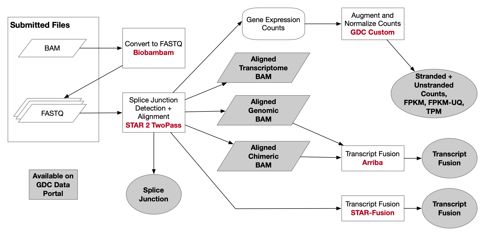

# mRNA Analysis Pipeline

## Introduction
The GDC mRNA quantification analysis pipeline measures gene level expression with [STAR](https://github.com/alexdobin/STAR/blob/master/doc/STARmanual.pdf) as raw read counts. Subsequently the counts are augmented with several transformations including Fragments per Kilobase of transcript per Million mapped reads (FPKM), upper quartile normalized FPKM (FPKM-UQ), and Transcripts per Million (TPM). These values are additionally annotated with the gene symbol and gene bio-type. These data are generated through this pipeline by first aligning reads to the GRCh38 [reference genome](https://gdc.cancer.gov/download-gdc-reference-files) and then by quantifying the mapped reads. To facilitate harmonization across samples, all RNA-Seq reads are treated as unstranded during analyses.

## Data Processing Steps

### RNA-Seq Alignment Workflow
The mRNA Analysis pipeline begins with the [Alignment Workflow](/Data_Dictionary/viewer/#?view=table-definition-view&id=alignment_workflow), which is performed using a two-pass method with [STAR](https://github.com/alexdobin/STAR/blob/master/doc/STARmanual.pdf). STAR aligns each [read group](/Data_Dictionary/viewer/#?view=table-definition-view&id=read_group) separately and then merges the resulting alignments into one. Following the methods used by the International Cancer Genome Consortium [ICGC](https://icgc.org/) ([github](https://github.com/akahles/icgc_rnaseq_align)), the two-pass method includes a splice junction detection step, which is used to generate the final alignment. This workflow outputs a genomic BAM file, which contains both aligned and unaligned reads. Quality assessment is performed pre-alignment with [FASTQC](http://www.bioinformatics.babraham.ac.uk/projects/fastqc/) and post-alignment with [Picard Tools](http://broadinstitute.github.io/picard/).

Files that were processed after Data Release 14 have associated transcriptomic and chimeric alignments in addition to the genomic alignment detailed above. This only applies to aliquots with at least one set of paired-end reads. The chimeric BAM file contains reads that were mapped to different chromosomes or strands (fusion alignments). The genomic alignment files contain chimeric and unaligned reads to facilitate the retrieval of all original reads. The transcriptomic alignment reports aligned reads with transcript coordinates rather than genomic coordinates. The transcriptomic alignment is also sorted differently to facilitate downstream analyses. BAM index file pairing is not supported by this method of sorting, which does not allow for BAM slicing on these alignments. The splice-junction file for these alignments are also available.

Files that were processed after Data Release 25 will have associated [gene fusion files](#fusion-pipelines).

As of Data Release 32 the reference annotation will be updated to GENCODE v36 and HT-Seq will no longer be used.

[](images/RNA-Seq-DR32_Image.png "Click to see the full image.")

| I/O | Entity | Format |
|---|---|---|
| Input | [Submitted Unaligned Reads](/Data_Dictionary/viewer/#?view=table-definition-view&id=submitted_unaligned_reads) or [Submitted Aligned Reads](/Data_Dictionary/viewer/#?view=table-definition-view&id=submitted_aligned_reads) |  FASTQ or BAM |
| Output | [Aligned Reads](/Data_Dictionary/viewer/#?view=table-definition-view&id=aligned_reads) | BAM  |

### RNA-Seq Alignment Command Line Parameters

__Note that version numbers may vary in files downloaded from the GDC Data Portal due to ongoing pipeline development and improvement.__

=== "Original"

    ```shell
    # STAR-2

    ### For users with access to the ICGC pipeline:

    python star_align.py \
    --genomeDir <star_index_path> \
    --FastqFileIn <input_fastq_path> \
    --workDir <work_dir> \
    --out <output_bam> \
    --genomeFastaFiles <reference> \
    --runThreadN 8 \
    --outFilterMultimapScoreRange 1 \
    --outFilterMultimapNmax 20 \
    --outFilterMismatchNmax 10 \
    --alignIntronMax 500000 \
    --alignMatesGapMax 1000000 \
    --sjdbScore 2 \
    --limitBAMsortRAM 0 \
    --alignSJDBoverhangMin 1 \
    --genomeLoad NoSharedMemory \
    --outFilterMatchNminOverLread 0.33 \
    --outFilterScoreMinOverLread 0.33 \
    --twopass1readsN -1 \
    --sjdbOverhang 100 \
    --outSAMstrandField intronMotif \
    --outSAMunmapped Within

    ### For users without access to the ICGC pipeline:

    ### Step 1: Building the STAR index.*

    STAR
    --runMode genomeGenerate
    --genomeDir <star_index_path>
    --genomeFastaFiles <reference>
    --sjdbOverhang 100
    --sjdbGTFfile <gencode.v36.annotation.gtf>
    --runThreadN 8

    ### Step 2: Alignment 1st Pass.

    STAR
    --genomeDir <star_index_path>
    --readFilesIn <fastq_left_1>,<fastq_left2>,... <fastq_right_1>,<fastq_right_2>,...
    --runThreadN <runThreadN>
    --outFilterMultimapScoreRange 1
    --outFilterMultimapNmax 20
    --outFilterMismatchNmax 10
    --alignIntronMax 500000
    --alignMatesGapMax 1000000
    --sjdbScore 2
    --alignSJDBoverhangMin 1
    --genomeLoad NoSharedMemory
    --readFilesCommand <bzcat|cat|zcat>
    --outFilterMatchNminOverLread 0.33
    --outFilterScoreMinOverLread 0.33
    --sjdbOverhang 100
    --outSAMstrandField intronMotif
    --outSAMtype None
    --outSAMmode None

    ### Step 3: Intermediate Index Generation.

    STAR
    --runMode genomeGenerate
    --genomeDir <output_path>
    --genomeFastaFiles <reference>
    --sjdbOverhang 100
    --runThreadN <runThreadN>
    --sjdbFileChrStartEnd <SJ.out.tab from previous step>

    ### Step 4: Alignment 2nd Pass.

    STAR
    --genomeDir <output_path from previous step>
    --readFilesIn <fastq_left_1>,<fastq_left2>,... <fastq_right_1>,<fastq_right_2>,...
    --runThreadN <runThreadN>
    --outFilterMultimapScoreRange 1
    --outFilterMultimapNmax 20
    --outFilterMismatchNmax 10
    --alignIntronMax 500000
    --alignMatesGapMax 1000000
    --sjdbScore 2
    --alignSJDBoverhangMin 1
    --genomeLoad NoSharedMemory
    --limitBAMsortRAM 0
    --readFilesCommand <bzcat|cat|zcat>
    --outFilterMatchNminOverLread 0.33
    --outFilterScoreMinOverLread 0.33
    --sjdbOverhang 100
    --outSAMstrandField intronMotif
    --outSAMattributes NH HI NM MD AS XS
    --outSAMunmapped Within
    --outSAMtype BAM SortedByCoordinate
    --outSAMheaderHD @HD VN:1.4
    --outSAMattrRGline <formatted RG line provided by wrapper>
    ```

=== "DR15Plus"

    ```shell
    # STAR-2

    STAR \
    --readFilesIn <fastq_files> \
    --outSAMattrRGline <read_group_strings> \
    --alignIntronMax 1000000 \
    --alignIntronMin 20 \
    --alignMatesGapMax 1000000 \
    --alignSJDBoverhangMin 1 \
    --alignSJoverhangMin 8 \
    --alignSoftClipAtReferenceEnds Yes \
    --chimJunctionOverhangMin 15 \
    --chimMainSegmentMultNmax 1 \
    --chimOutType Junctions SeparateSAMold WithinBAM SoftClip \
    --chimSegmentMin 15 \
    --genomeDir <genome_dir> \
    --genomeLoad NoSharedMemory \
    --limitSjdbInsertNsj 1200000 \
    --outFileNamePrefix <output_prefix> \
    --outFilterIntronMotifs None \
    --outFilterMatchNminOverLread 0.33 \
    --outFilterMismatchNmax 999 \
    --outFilterMismatchNoverLmax 0.1 \
    --outFilterMultimapNmax 20 \
    --outFilterScoreMinOverLread 0.33 \
    --outFilterType BySJout \
    --outSAMattributes NH HI AS nM NM ch \
    --outSAMstrandField intronMotif \
    --outSAMtype BAM Unsorted \
    --outSAMunmapped Within \
    --quantMode TranscriptomeSAM GeneCounts \
    --readFilesCommand <zcat, etc> \
    --runThreadN <threads> \
    --twopassMode Basic
    ```

=== "DR32"

      ```shell
      # STAR Genome Index
      STAR
      --runMode genomeGenerate
      --genomeDir <star_index_path>
      --genomeFastaFiles <reference>
      --sjdbOverhang 100
      --sjdbGTFfile <gencode.v36.annotation.gtf>
      --runThreadN 8

      # STAR Alignment
      # STAR v2
      STAR
      --readFilesIn <fastq_files> \
      --outSAMattrRGline <read_group_strings> \
      --genomeDir <genome_dir> \
      --readFilesCommand <cat, zcat, etc> \
      --runThreadN <threads> \
      --twopassMode Basic \
      --outFilterMultimapNmax 20 \
      --alignSJoverhangMin 8 \
      --alignSJDBoverhangMin 1 \
      --outFilterMismatchNmax 999 \
      --outFilterMismatchNoverLmax 0.1 \
      --alignIntronMin 20 \
      --alignIntronMax 1000000 \
      --alignMatesGapMax 1000000 \
      --outFilterType BySJout \
      --outFilterScoreMinOverLread 0.33 \
      --outFilterMatchNminOverLread 0.33 \
      --limitSjdbInsertNsj 1200000 \
      --outFileNamePrefix <output prefix> \
      --outSAMstrandField intronMotif \
      --outFilterIntronMotifs None \
      --alignSoftClipAtReferenceEnds Yes \
      --quantMode TranscriptomeSAM GeneCounts \
      --outSAMtype BAM Unsorted \
      --outSAMunmapped Within \
      --genomeLoad NoSharedMemory \
      --chimSegmentMin 15 \
      --chimJunctionOverhangMin 15 \
      --chimOutType Junctions SeparateSAMold WithinBAM SoftClip \
      --chimOutJunctionFormat 1 \
      --chimMainSegmentMultNmax 1 \
      --outSAMattributes NH HI AS nM NM ch
      ```

\*These indices are available for download at the [GDC Website](https://gdc.cancer.gov/about-data/data-harmonization-and-generation/gdc-reference-files) and do not need to be built again.

### mRNA Expression Workflow

The primary counting data is generated by STAR and includes a gene ID, unstranded, and stranded counts data. Following alignment, the raw counts files produced by STAR are augmented with commonly used counts transformations (FPKM, FPKM-UQ, and TPM) along with basic annotations as part of the [RNA Expression Workflow](/Data_Dictionary/viewer/#?view=table-definition-view&id=rna_expression_workflow). These data are provided in a tab-delimited format. [GENCODE v36](https://www.gencodegenes.org/human/release_36.html) was used for gene annotation.

Note that the STAR counting results will not count reads that are mapped to more than one different gene. Below are two files that list genes that are completely encompassed by other genes and will likely display a value of zero.

* [Overlapped Genes (stranded)](/Data/Bioinformatics_Pipelines/overlap.gene.stranded.tsv)
* [Overlapped Genes (unstranded)](/Data/Bioinformatics_Pipelines/overlap.gene.strandless.tsv)

| I/O | Entity | Format |
|---|---|---|
| Input | [Aligned Reads](/Data_Dictionary/viewer/#?view=table-definition-view&id=aligned_reads) |  BAM |
| Output | [Gene Expression](/Data_Dictionary/viewer/#?view=table-definition-view&id=gene_expression) | TXT  |

### mRNA Quantification Command Line Parameters

HTSeq

=== "Current"

    ```
    Counts are produced by STAR concurrent with alignment.
    ```

=== "Original"

    ```shell
    htseq-count \
    -m intersection-nonempty \
    -i gene_id \
    -r pos \
    -s no \
    - gencode.v22.annotation.gtf
    ```

=== "DR15-31"

    ```shell
    htseq-count \
    -f bam \
    -r name \
    -s no \
    -a 10 \
    -t exon \
    -i gene_id \
    -m intersection-nonempty \
    <input_bam> \
    <gtf_file> > <counts_file>
    ```

## mRNA Expression Transformation

RNA-Seq expression level read counts produced by the workflow are normalized using three commonly used methods: FPKM, FPKM-UQ, and TPM. Normalized values should be used only within the context of the entire gene set. Users are encouraged to normalize raw read count values if a subset of genes is investigated.

### FPKM

The fragments per kilobase of transcript per million mapped reads (FPKM) calculation aims to control for transcript length and overall sequencing quantity.

### Upper Quartile FPKM

The upper quartile FPKM (FPKM-UQ) is a modified FPKM calculation in which the protein coding gene in the 75th percentile position is substituted for the sequencing quantity. This is thought to provide a more stable value than including the noisier genes at the extremes.

### TPM

The transcripts per million calculation is similar to FPKM, but the difference is that all transcripts are normalized for length first. Then, instead of using the total overall read count as a normalization for size, the sum of the length-normalized transcript values are used as an indicator of size.

### Calculations

[](images/normalizations_calc.png "Click to see the full image.")

__Note:__ The read count is multiplied by a scalar (10<sup>9</sup>) during normalization to account for the kilobase and 'million mapped reads' units.

### Examples

__Sample 1: Gene A__

* Gene length: 3,000 bp
* 1,000 reads mapped to Gene A
* 1,000,000 reads mapped to all protein-coding regions
* Read count in Sample 1 for 75th percentile gene: 2,000
* Number of protein coding genes on autosomes: 19,029
* Sum of length-normalized transcript counts: 9,000,000

__FPKM for Gene A__ = 1,000 \* 10^9 / (3,000 \* 50,000,000) = __6.67__

__FPKM-UQ for Gene A__ = 1,000) \* 10^9 / (3,000 \* 2,000 \* 19,029) = __8.76__

__TPM for Gene A__ = (1,000 * 1,000 / 3,000) * 1,000,000 / (9,000,000) = __37.04__

## Fusion Pipelines

The GDC uses two pipelines for the detection of gene fusions.

### STAR-Fusion Pipeline
The GDC gene fusion pipeline uses the STAR-Fusion v1.6 algorithm to generate gene fusion data.
STAR-Fusion pipeline processes the output generated by STAR aligner to map junction reads
and spanning reads to a junction annotation set. It utilizes a chimeric junction file from
running the STAR aligner and produces a tab-limited gene fusion prediction file.
The prediction file provides fused gene names, junction read count and breakpoint information.

### Arriba Fusion Pipeline

The [Arriba gene fusion pipeline](https://github.com/suhrig/arriba) uses Arriba v1.1.0 to detect gene fusions from the RNA-Seq data of tumor samples.


## scRNA-Seq Pipeline (single-nuclei)

The GDC processes single-cell RNA-Seq (scRNA-Seq) data using the [Cell Ranger pipeline](https://support.10xgenomics.com/single-cell-gene-expression/software/pipelines/latest/what-is-cell-ranger) to calculate gene expression followed by [Seurat](https://satijalab.org/seurat/) for secondary expression analysis.

### scRNA Gene Expression Pipeline

The gene expression pipeline, which uses Cell Ranger, generates three files:

* Aligned reads file (BAM)
* Raw counts matrix - contains all barcodes in [Market Exchange Format](https://math.nist.gov/MatrixMarket/formats.html) (MEX)
* Filtered counts matrix - contains only detected cellular barcodes  (MEX)

### scRNA Analysis Pipeline

The analysis pipeline, which uses the Seurat software, generates three files from an input of Filtered counts matrix:

* Analysis - PCA, UMAP, tSNE values, and graph-based clustering results with associated metadata (TSV).
* Differential gene expression - DEG information comparing cells from one cluster to the rest of the cells (TSV).
* Full Seurat analysis log as a loom object in [HDF5](https://portal.hdfgroup.org/hdf5/v1_14/_u_g.html) format.

When the input RNA was extracted from nuclei instead of cytoplasm, a slightly modified quantification method is implemented to include introns. Currently, these single-nuclei RNA-Seq (snRNA-Seq) analyses share the same experimental strategy (scRNA-Seq) in the Data Portal, and can be filtered by querying for aliquot.analyte_type = "Nuclei RNA".

## File Access and Availability

To facilitate the use of harmonized data in user-created pipelines, RNA-Seq gene expression is accessible in the GDC Data Portal at several intermediate steps in the pipeline. Below is a description of each type of file available for download in the GDC Data Portal.

| Type | Description | Format |
|---|---|---|
| RNA-Seq Alignment | RNA-Seq reads that have been aligned to the GRCh38 build. Reads that were not aligned are included to facilitate the availability of raw read sets.  |  BAM |
| STAR Read Counts | The number of reads aligned to each gene, calculated by STAR, along with values using common normalization methods. |  TSV |
