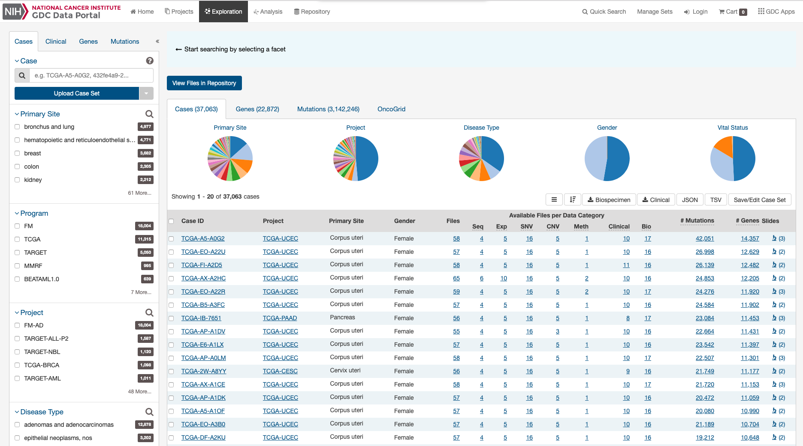

# Analysis Tool

Brief introduction to the full analysis tool goes here.

## One Feature of the Tool
Here you can put a brief description of an analysis tool feature you would like to introduce.

### Some Component of the Analysis Tool

Brief description and purpose of the specific component. Image files can be put in the "/images" folder and can be referenced from there. This should either work for most pages, or can be easily created.

Below is how a list of buttons/tabs/parameters should be presented. It would generally be described in this text here.

* __Item1:__ Information about the first item.
* __Item2:__ Information about the second item.
    * __Enum1:__ If some item has components that need explaining, indent them.
    * __Enum2:__ If some item has components that need explaining, indent them.
* __Item3:__ Information about the third item.

### Making Changes to gdc-docs

1. Go to https://github.com/NCI-GDC/gdc-docs (__NOT__ https://github.com/NCIP/gdc-docs)
1. Make changes to a branch and make a PR to the __develop__ branch.
1. Send a link to the PR to support@nci-gdc.datacommons.io with information on when you think a deployment would be needed.
1. The GDC User Services team may recommend changes or reformatting, or approve.  
