# CNV Tool

## Launch CNV Tool

The CNV Tool allows users to browse somatic copy number alteration segments over any coding, noncoding, or intergenic loci. To launch the tool, users can use the search box to search for a gene, or directly input a genomic coordinate.
[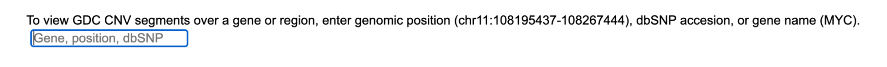](images/cnv-tool/image1-gene-search.png "Click to see the full image.")

As an example, enter "crebbp" to search for the CREBBP gene locus.

[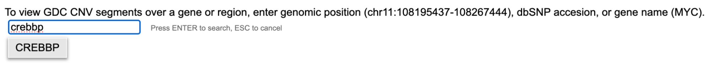](images/cnv-tool/image2-gene-search.png "Click to see the full image.")

This allows the launch of the CNV Tool over the CREBBP locus as seen below.

## CNV Tool Components

On the top row are genome browser control options, including a search box that prints the genomic coordinate of the current locus, and zoom in/out buttons.

Under the control buttons is the genomic coordinate ruler. The ruler allows zooming into a region of interest by dragging on it.

Under the genomic ruler are the genome browser tracks, including GDC CNV segment track, and gene track. To pan the genome browser, users can drag on any track and pan left or right. Under the genomic tracks is the track legend.

The GDC CNV segment track displays horizontal lines in different colors indicating CNV segments in the current view range from the current cohort. Each line is one CNV segment, where line start and stop positions are segment start and stop coordinates, and line color for copy number change as indicated in the legend. 

Hovering the cursor over a CNV segment will display a tooltip as below.

Clicking on a CNV segment will bring out additional details about the case.

[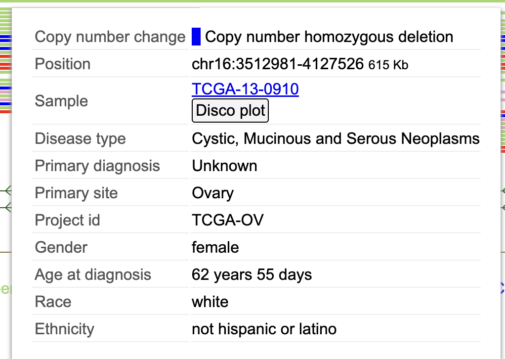](images/cnv-tool/image5-cnv-segment-additional-details.png "Click to see the full image.")

The CNV tool organizes CNV segments by case, with one row for each case. Each row will contain all CNV segments of that case for the view range. Thus it may show multiple CNV segments in a row, all from the same case.

## CNV Data Summaries

At the top left of the CNV tool are two text labels showing summaries of the displayed data, including number of CNV segments and number of samples. Click each label to show corresponding options.

[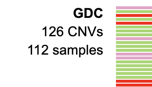](images/cnv-tool/image7-cnv-data-summaries.png "Click to see the full image.")

Click on the "N CNVs" label and then select the "List" option. A panel will display the list of CNV segments in view range. Click on a row to see details of each segment. 

[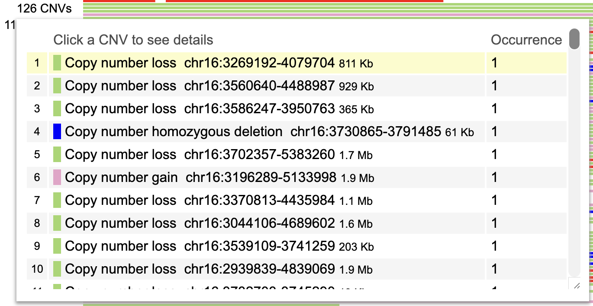](images/cnv-tool/image8-n-cnvs-label-summary.png "Click to see the full image.")

Clicking the "N samples" label will show a summary of all cases with at least one visible CNV segment across a set of dictionary variables. 

With any variable summary, click on a category to create a new CNV track side-by-side with the existing CNV track and display CNV data from a subset of cases from that category.

[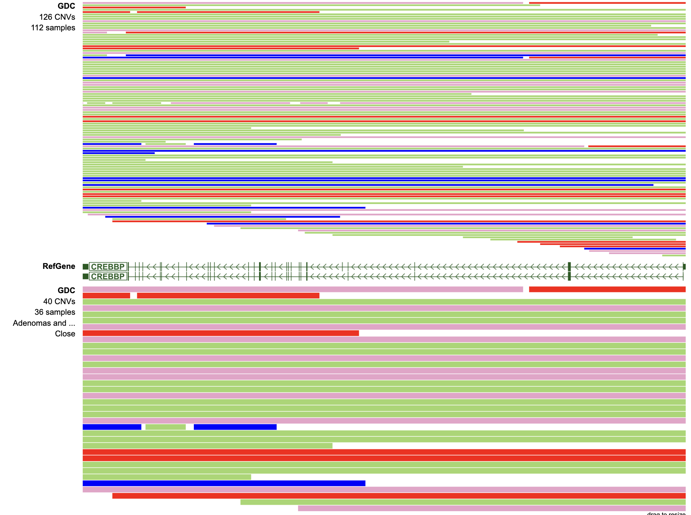](images/cnv-tool/image10-cnv-track-side-by-side-example.png "Click to see the full image.")

## Customize Display Parameters 

The track legend at the bottom provides ways to tune the CNV tool display. Click on a copy number change category to show a menu with options.

[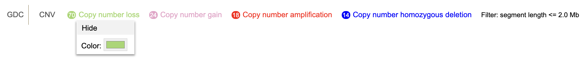](images/cnv-tool/image11-cnv-tool-display-example.png "Click to see the full image.")

Clicking "Hide" for "Copy number loss" will update the view as below. To show "Copy number loss" events again, click the striked label in the legend. 

[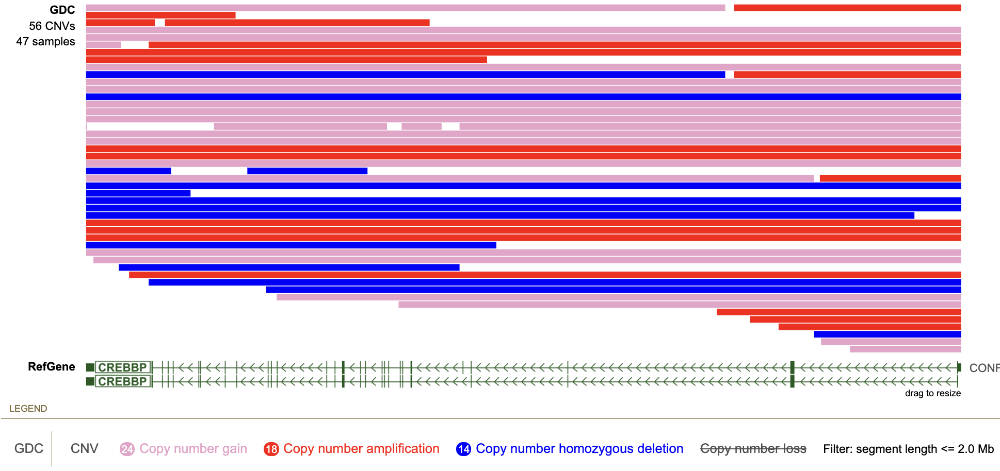](images/cnv-tool/image12-hide-copy-number-loss-example.png "Click to see the full image.")

Click on the text label "Filter" at the end of the legend to show a menu with an input box. The CNV Tool by default limits the maximum length of segments displayed to 2 Mb. The maximum length is adjustable.

[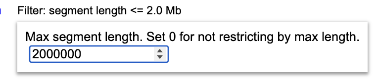](images/cnv-tool/image13-max-segment-length-modification.png "Click to see the full image.")

Setting the max length to a larger value will allow it to include more segments of a longer length, as seen below using 8 Mb.

[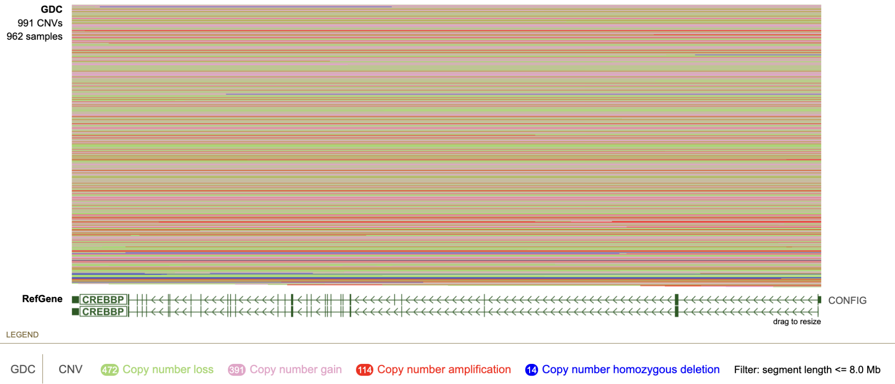](images/cnv-tool/image14-larger-max-length-example.png "Click to see the full image.")

Setting the max length to a smaller value will limit the analysis to focal CNV segments and exclude large ones, as demonstrated below using a 500 Kb threshold.

[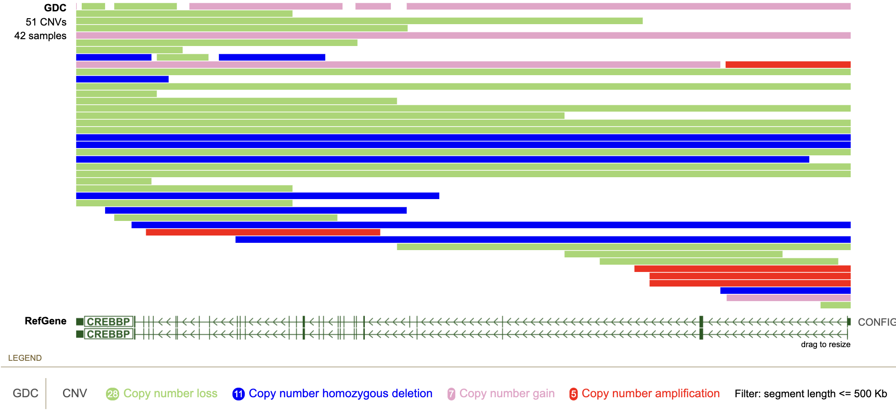](images/cnv-tool/image15-smaller-max-segment-example.png "Click to see the full image.")

## Density Mode

The CNV Tool can dynamically switch display style when the number of displayed CNV segments exceeds 1,000. As an example, the following example shows a 1.6 Mb region centered on PAX5 with 994 CNV segments, highlighting a set of focal deletions (stacks of green lines) overlapping PAX5.

[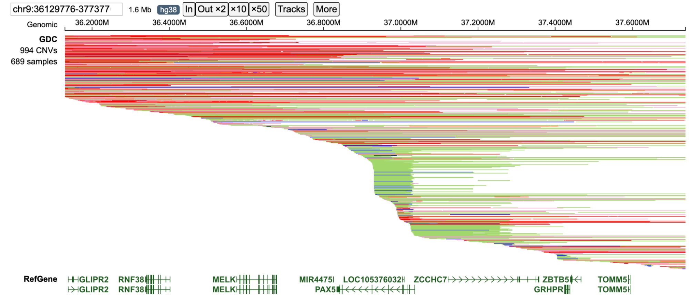](images/cnv-tool/image16-default-display-style.png "Click to see the full image.")

Upon zooming out to 3.2 Mb, the CNV Tool switches to a density view displaying the density of gain and loss events as a pair of coverage tracks, with a numerical axis on the left of the track which has a symmetrical  max scale for both  gain and loss. The number of CNV segments is now 1,447 exceeding the limit of 1,000 and allowing the CNV Tool to switch to density view to improve performance. In the density view, a deletion hotspot is visible over PAX5. 

[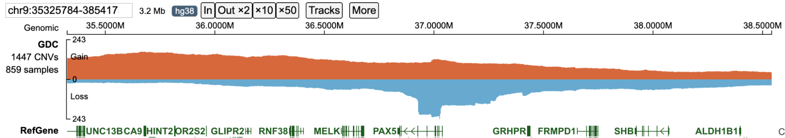](images/cnv-tool/cnv16.png "Click to see the full image.")

The CNV Tool has an upper limit of 10,000 CNV segments per view. To demonstrate this limit, the following example shows a 31 Mb region on chromosome 9 containing 10,000 CNVs. At this scale, a prominent deletion hotspot becomes visible at the CDKN2A/2B locus on the telomeric region of chromosome 9.

[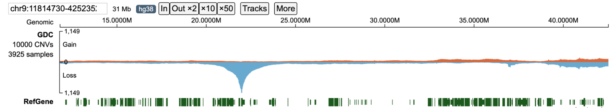](images/cnv-tool/cnv17.png "Click to see the full image.")