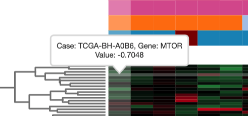
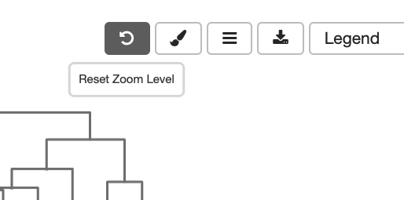

# Custom Set Analysis

In addition to the [Exploration page](Exploration.md), the GDC Data Portal also has features used to save and compare sets of cases, genes, and mutations. These sets can either be generated with existing filters (e.g. males with lung cancer) or through custom selection (e.g. a user-generated list of case IDs).

Note that saving a set only saves the type of entity included in the set. For example, a saved case set will not include filters that were applied to genes or mutations. Please be aware that your custom sets are deleted during each new GDC data release. You can export them and re-upload them in the "Manage Sets" link at the top right of the Portal.

## Generating a Cohort for Analysis

Cohort sets are completely customizable and can be generated for cases, genes, or mutations using the following methods:

__Upload ID Set:__ This feature is available in the "Manage Sets" link at the top right of the Portal. Choose "Upload Set" and then select whether the set comprises cases, genes, or mutations. A set of IDs (IDs* or UUIDs) can then be uploaded in a text file or copied and pasted into the list of identifiers field along with a name identifying the set. Once the list of identifiers is uploaded, they are validated and grouped according to whether the identifier matched an existing GDC ID or did not match ("Unmatched").

\* This is referred to as a `submitter_id` in the GDC API, which is a non-UUID identifier such as a TCGA barcode.

__Apply Filters in Exploration:__ Sets can be assembled using the existing filters in the Exploration page.  They can be saved by choosing the "Save/Edit Case Set" button under the pie charts for case sets. This will prompt a decision to save as new case set.

Similarly, gene and mutation filters can be applied and saved in the Exploration page in the Genes and Mutations tab, respectively.

## Analysis Page
Clicking on the `Analysis` button in the top toolbar will launch the Analysis Page which displays the various options available for comparing saved sets.

There are two tabs on this page:

* __Launch Analysis__: Where users can select either to do `Set Operations` or `Cohort Comparison`
* __Results__: Where users can view the results of current or previous set analyses

## Analysis Page: Set Operations

Up to three sets of the same set type can be compared and exported based on complex overlapping subsets. The features of this page include:

* __Venn Diagram:__ Visually displays the overlapping items included within the three sets. Subsets based on overlap can be selected by clicking one or many sections of the Venn diagram. As sections of the Venn Diagram become highlighted in blue, their corresponding row in the overlap table becomes highlighted.  

* __Summary Table:__ Displays the alias, item type, and name for each set included in this analysis

* __Overlap Table:__ Displays the number of overlapping items with set operations rather than a visual diagram. Subsets can be selected by checking boxes in the "Select" column, which will highlight the corresponding section of the Venn Diagram. As rows are selected, the "Union of selected sets" row is populated. Each row has an option to save the subset as a new set,  export the set as a TSV, or view files in the repository. The links that correspond to the number of items in each row will open the cohort in the Exploration page.  

## Analysis Tab: Gene Expression
The gene expression heat map can be displayed for custom sets of cases and genes.  Visualize gene expression data between case set and gene set data.

### Running a Gene Expression Analysis

First a case and gene set must be selected. See the [Custom Sets](https://docs.gdc.cancer.gov/Data_Portal/Users_Guide/Custom_Set_Analysis/#upload-case-set) section for instructions on how to create these sets.  Next, these cases are checked to verify the presence of RNA-Seq data relating to them in the GDC by choosing "Check Data". This returns the number of cases with and without gene expression data.  Choosing the "Run" button will run the gene expression analysis.  

### Visualizing a Gene Expression Analysis

The gene expression analysis plot is visualized on a grid with each case represented with a column and each gene represented with a row.  The two trees visualize the cases and genes that have the most similar expression profiles.  

Each node on the tree can be chosen to zoom in on the related cases or genes. The Zoom can be reset by choosing the __Reset Zoom Level__ button at the top of the figure.

At the top of the gene expression analysis figure, there are a few buttons that have the following functionalities.

* __Reset Zoom Level:___ Reset Zoom setting of HeatMap to default.
* __Edit Heatmap Colors:___ Changes the color setting displayed in the output of the HeatMap.
* __Edit Categories:___ Adds or removes the following categories displayed: Age at Diagnosis, Gender, Vital Status,
                        Ethnicity, Race.
* __Download:___ Allows for downloads of the HeatMap in PDF, PNG or TSV formats.
* __Legend:___ Provides a color visualization of the following categories: Age of Diagnosis, Ethnicity, Gender, Race,
Vital Status.

## Analysis Tab: Cohort Comparison

The "Cohort Comparison" analysis displays a series of graphs and tables that demonstrate the similarities and differences between two case sets. The following features are displayed for each two sets:

* A key detailing the number of cases in each cohort and the color that represents each (blue/gold)

* A Venn diagram, which shows the overlap between the two cohorts.  The Venn diagram can be opened in a 'Set Operations' tab by choosing "Open venn diagram in new tab"

* A selectable [survival plot](Projects/#survival-analysis) that compares both sets with information about the percentage of represented cases

* A breakdown of each cohort by selectable clinical facets with a bar graph and table. Facets include `vital_status`, `gender`, `race`, `ethnicity`, and `age_at_diagnosis`.  A p-value (if it can be calculated from the data) that demonstrates whether the statuses are proportionally represented is displayed for the `vital_status`, `gender`, and `ethnicity` facets.  

## Analysis Page: Results

The results of the previous analyses are displayed on this page.

Each tab at the left side of the page is labeled according to the analysis type and the date that the analysis was performed and can be reviewed as long as it is present. The "Delete All" button will remove all of the previous analyses.  
