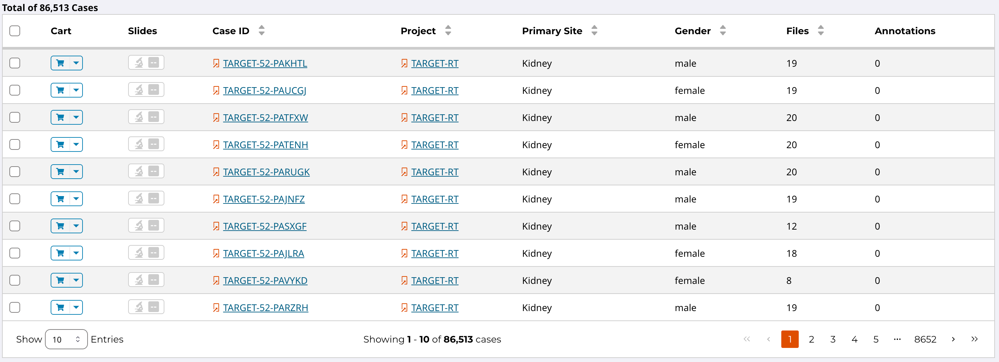

# GDC Analysis Tool Software Development Kit (SDK)

This guide will detail the process of developing applications for the GDC Data Portal 2.0. It describes the structure of
the GDC Data Portal, how to use the GDC Data Portal API, and how to develop applications for the GDC Data Portal.

The GDC Data Portal is a repository and computational platform for cancer researchers who need to understand cancer, its
clinical progression, and response to therapy. The GDC Data Portal supports the development of applications that allow
for analysis, visualization, and refinement of cohorts.

The GDC Data Portal is built on top of the [GDC API](https://docs.gdc.cancer.gov/API/Users_Guide/Getting_Started/),
which provides access to the GDC data. The GDC Data Portal provides an Analysis Tool Framework (ATF) for developing
applications that can be used to analyze, visualize, and download data from the GDC.

The GDC Data Portal is built with the [React](https://reactjs.org/) framework and 
the [Redux](https://redux.js.org/) library for state management. The GDC Data Portal uses [NextJS](https://nextjs.org/) as it's application framework which 
provides server-side rendering of React components. [Mantine.dev](https://mantine.dev/) is the component library, and

styling is through [TailwindCSS](https://tailwindcss.com/). The GDC Data Portal is built on top of the GDC API, which provides access to 
the GDC data.


*Architecture of the GDC Data Portal*

## Overview of an Application

Applications are React higher-order components (HOC) that are rendered in
the [Analysis Center](https://portal.gdc.cancer.gov/analysis_page?app=). The GDC Data Portal major functions such as
Projects, Repository,  and Protein Paint are all applications. Each application handles a specific task such as analysis or
visualization and can also be used to refine and build cohorts. Applications are cohort centric and can 
query the GDC API for additional information.

Local and Global filters are available to applications. Local filters are filters that are specific to the application
and are used to refine the data that is displayed in the application. Local filters are those available from the GDC API
and are typically not the most common. For example in the Mutation Frequency application, the local filters are the gene
and mutation type filters. In the figure below the local filters are highlighted in yellow. These filters are used to
refine the input cohort allowing users to drill down to specific genes and mutation types of interest in the cohort.


### Local vs Global Filters

The GDC Data Portal application's input can be the current cohort or multiple user defined cohorts. The application then 
allow users to add filters refining the cohort, create new additional cohorts, or display the data in a visualization. 
Applications  typically have:

* **Local filters**  Refine the data displayed in the application
* **Global filters**  Defines the cohort
* **UI Components** Display the data in the application
* **State** Stores the data displayed in the application
* **Actions** Updates the state of the application

Applications can also create new cohorts. These cohorts can be used by other GDC Data Portal applications. The figure
below illustrates the application components and cohort filters.


## Cohorts and Filters

From an application perspective, a cohort is an Object containing the following information:

```typescript
interface Cohort {
    id: string;        // unique id for cohort
    name: string;      // name of cohort
    filters: FilterSet; // active filters for cohort
    caseSet: CaseSetDataAndStatus; // case ids that are in the cohort
    modified?: boolean; // flag which is set to true is modified and unsaved
    modified_datetime: string; // last time cohort was modified
    saved?: boolean; // flag indicating if cohort has been saved.
    counts: CountsDataAndStatus; //case, file, etc. counts of a cohort
}
```

Likely the most important part of the cohort is the `filters` field. The `filters` field contains the active filters for
the cohort. The `filters` field is a `FilterSet` object. The `FilterSet` object contains the active filters for the
cohort. When calling either the GDC REST API or GDC GraphQL API the `FilterSet` is converted to the appropriate format
for the API. The `FilterSet` object is of the form:

```typescript
interface FilterSet {
    op: "and" | "or"; // operator for combining filters
    root: Record<string, Operation>; // map of filter name to filter operation
}
```

Operation are GDC API filters as described in
the [GDC API](https://docs.gdc.cancer.gov/API/Users_Guide/Search_and_Retrieval/#filters-specifying-the-query). These
are:

* Equals
* NotEquals
* LessThan
* LessThanOrEquals
* GreaterThan
* GreaterThanOrEquals
* Exists
* Missing
* Includes
* Excludes
* ExcludeIfAny
* Intersection
* Union

The `root` field is a map of filter names (as defined in the GDC API) to filter operation. The filter operation can be
either a single operation or a `FilterSet` object. The `op` field will eventually support either `and` or `or`, however
at this time only `and` is supported. The `and`operator is used to combine filters using the `and` operator. The `or`
operator is used to combine filters using the `or` operator. The `FilterSet` object is converted to the appropriate
format for the GDC API when the cohort is saved.

When using the GDC REpresentational State Transfer (REST) API, the FilterSet can be converted into the appropriate 
format using the `filterSetToOperation` function. When using the GDC GraphQL API, the FilterSet can be using the
`convertFilterSetToGraphQL` function. The API  guide will provide information on what format the filters should be in for the API. Also as the code is in TypeScript,
the IDE will provide information on the format as well.

### Obtaining Cohort Information

The current active cohort can be accessed via the selector `selectCurrentCohort`. This selector returns the current
cohort, which is the cohort that is currently being displayed in the Cohort Management Bar. Accessing the current cohort
is done via the
selector:

```typescript
import {useCoreSelector, selectCurrentCohort} from '@gff/core';

const currentCohort = useSelector(selectCurrentCohort);
```

By using the selector, the component/application will be updated when the cohort changes. There are also selectors for
getting a particular field from the cohort. For example, to get the cohort name, the selector `selectCurrentCohortName`
can be used. The selectors are:

* `selectCurrentCohort`
* `selectCurrentCohortName`
* `selectCurrentCohortId`
* `selectCurrentCohortFilters`
* `selectCurrentCohortModified`
* `selectCurrentCohortModifiedDatetime`
* `selectCurrentCohortSaved`
* `selectCurrentCohortCounts`

The current active filters can be accessed via the selector `selectCurrentCohortFilters`. This selector returns the
current filters,
which are the filters that are currently being displayed in the Cohort Management Bar. Accessing the current filters is
done via the
selector:

```typescript
import {useCoreSelector, selectCurrentFilters} from '@gff/core';

const currentFilters = useSelector(selectCurrentCohortFilters);
```

By using the selector, the application will be updated when the filters change. The filters are returned as
a `FilterSet` object described above.

All the cohorts can be selected using the selector `selectAllCohorts`. This selector returns all the cohorts in the
store. Accessing all the cohorts is done via the selector:

```typescript
import {useCoreSelector, selectAllCohorts} from '@gff/core';

const allCohorts = useSelector(selectAllCohorts);
```

# Using the GDC Data Portal Application API

The GDC Data Portal provides a number of hooks for querying the GDC API. These hooks are located in the `@gff/core` package.
The hooks are designed to work in a manner similar to the RTL Query hooks. The hooks take arguments and return an
object.
The object contains the data and the status of the query. The status of the query is stored in the `isSuccess` variable.
The @gff/core package also provides a set of selectors that return values stored in the core redux store: `CoreStore`.

There are a number of hooks and selectors that are available for querying the GDC API, a subset of which are shown
below:


## Case Information

The GDC Data Portal provides several hooks for querying case information. These hooks are located in the `@gff/core`
package. Cases can be queried using several different methods. The `useAllCases` hook returns all the cases in the GDC
and can be filtered by the current cohort as shown below

```typescript
import {useCoreSelector, useAllCases} from '@gff/core';

...

const [pageSize, setPageSize] = useState(10);
const [offset, setOffset] = useState(0);
const [searchTerm, setSearchTerm] = useState<string>("");
const [sortBy, setSortBy] = useState<SortBy[]>([]);
const cohortFilters = useCoreSelector((state) =>
    selectCurrentCohortFilters(state),
);


const {data, isFetching, isSuccess, isError, pagination} = useAllCases({
    fields: [
        "case_id",
        "submitter_id",
        "primary_site",
        "disease_type",
        "project.project_id",
        "project.program.name",
        "demographic.gender",
        "demographic.race",
        "demographic.ethnicity",
        "demographic.days_to_death",
        "demographic.vital_status",
        "diagnoses.primary_diagnosis",
        "diagnoses.age_at_diagnosis",
        "summary.file_count",
        "summary.data_categories.data_category",
        "summary.data_categories.file_count",
        "summary.experimental_strategies.experimental_strategy",
        "summary.experimental_strategies.file_count",
        "files.file_id",
        "files.access",
        "files.acl",
        "files.file_name",
        "files.file_size",
        "files.state",
        "files.data_type",
    ],
    size: pageSize,
    filters: cohortFilters,
    from: offset * pageSize,
    sortBy: sortBy,
    searchTerm,
});
```

The `useAllCases` hook takes a number of arguments:

* `fields` - The fields to return from the GDC API
* `size` - The number of cases to return
* `filters` - The filters to apply to the cases
* `from` - The starting index of the cases to return
* `sortBy` - The fields to sort the cases by
* `searchTerm` - The search term to use to search the cases

This call is used in the Table view tab of the Cohort Management Bar.

Information for a single case can be queried using the `useCaseSummary` hook. This call is used in the caseView page:
[portal.gdc.cancer.gov/cases/5693302a-4548-4c0b-8725-0cb7c67bc4f8](https://portal.gdc.cancer.gov/cases/5693302a-4548-4c0b-8725-0cb7c67bc4f8)

```typescript
  const {data, isFetching} = useCaseSummary({
    filters: {
        content: {
            field: "case_id",
            value: case_id,
        },
        op: "=",
    },
    fields: [
        "files.access",
        "files.acl",
        "files.data_type",
        "files.file_name",
        "files.file_size",
        "files.file_id",
        "files.data_format",
        "files.state",
        "files.created_datetime",
        "files.updated_datetime",
        "files.submitter_id",
        "files.data_category",
        "files.type",
        "files.md5sum",
        "case_id",
        "submitter_id",
        "project.name",
        "disease_type",
        "project.project_id",
        "primary_site",
        "project.program.name",
        "summary.file_count",
        "summary.data_categories.file_count",
        "summary.data_categories.data_category",
        "summary.experimental_strategies.experimental_strategy",
        "summary.experimental_strategies.file_count",
        "demographic.ethnicity",
        "demographic.demographic_id",
        "demographic.gender",
        "demographic.race",
        "demographic.submitter_id",
        "demographic.days_to_birth",
        "demographic.days_to_death",
        "demographic.vital_status",
        "diagnoses.submitter_id",
        "diagnoses.diagnosis_id",
        "diagnoses.classification_of_tumor",
        "diagnoses.age_at_diagnosis",
        "diagnoses.days_to_last_follow_up",
        "diagnoses.days_to_last_known_disease_status",
        "diagnoses.days_to_recurrence",
        "diagnoses.last_known_disease_status"]
});
```

The `useCaseSummary` hook takes a number of arguments:

* `fields` - The fields to return from the GDC API
* `filters` - The filters to apply to the cases and where the caseId is passed in

## File Information

Similar to the case information, the GDC Data Portal provides a number of hooks for querying file information. These hooks
are located in the `@gff/core` package.
To get a list of files associated with a cohort, the `useGetFilesQuery` hook can be used. This call is used in the
Repository application which is used to display the files associated with a cohort.
The `useGetFilesQuery` hook takes a number of arguments:

```typescript
import {
    useCoreDispatch,
    useCoreSelector,
    selectCurrentCohortFilters,
    buildCohortGqlOperator,
    joinFilters,
    useFilesSize,
} from "@gff/core";

...

const coreDispatch = useCoreDispatch();
const [sortBy, setSortBy] = useState<SortBy[]>([]); // states to handle table sorting and pagination
const [pageSize, setPageSize] = useState(20);
const [offset, setOffset] = useState(0);

const repositoryFilters = useAppSelector((state) => selectFilters(state)); // as this is a app get the repository filters from the app state (local filters)
const cohortFilters = useCoreSelector((state) =>    // get the cohort filters from the core state (global filters)
    selectCurrentCohortFilters(state),
);

const {data, isFetching, isError, isSuccess} = useGetFilesQuery({
    case_filters: buildCohortGqlOperator(cohortFilters),
    filters: buildCohortGqlOperator(repositoryFilters),
    expand: [
        "annotations", //annotations
        "cases.project", //project_id
        "cases",
    ],
    size: pageSize,
    from: offset * pageSize,
    sortBy: sortBy,
});
```

The `useGetFilesQuery` hook takes a number of arguments:

* `case_filters` - The filters to apply to the cases
* `filters` - The filters to apply to the files
* `expand` - The fields to expand
* `size` - The number of files to return
* `from` - The starting index of the files to return
* `sortBy` - The fields to sort the files by

Note this hook was designed to take global filters (e.g. the current cohort as `case_filters`) and local filters (the
Repository filters).

Information for a single file can be queried using the `useFileSummary` hook. This call is used in
the `File Summary View`
page [portal.gdc.cancer.gov/files/0b5a9e7e-8e2e-4b7a-9b7e-ff5d9c5b2b2b](https://portal.gdc.cancer.gov/files/0b5a9e7e-8e2e-4b7a-9b7e-ff5d9c5b2b2b)

```typescript
 const {data: {files} = {}, isFetching} = useGetFilesQuery({
    filters: {
        op: "=",
        content: {
            field: "file_id",
            value: setCurrentFile,
        },
    },
    expand: [
        "cases",
        "cases.annotations",
        "cases.project",
        "cases.samples",
        "cases.samples.portions",
        "cases.samples.portions.analytes",
        "cases.samples.portions.slides",
        "cases.samples.portions.analytes.aliquots",
        "associated_entities",
        "analysis",
        "analysis.input_files",
        "analysis.metadata.read_groups",
        "downstream_analyses",
        "downstream_analyses.output_files",
        "index_files",
    ],
});
```

The `useFileSummary` hook takes several arguments:

* `filters` - The filters to apply to the cases and where the file uuid is passed in
* `expand` - The fields to expand

## Sets: Gene, SSMS, and Case

Sets are supported by the GDC API and are used to create an entity that represents a set of items as a `set_id`. Sets
are either gene sets, SSM sets, or case sets. All of the GDC APIs support passing sets as a filter parameter.
The GDC Data Portal provides a number of hooks for creating and querying set information.

A set can be created using one of the following hooks:

* `useCreateGeneSetFromValuesMutation`
* `useCreateSsmsSetFromValuesMutation`
* `useCreateCaseSetFromValuesMutation`
* `useCreateGeneSetFromFiltersMutation`
* `useCreateSsmsSetFromFiltersMutation`
* `useCreateCaseSetFromFiltersMutation`

These functions will create a set from either a list of values or a filter set. The `useCreate...SetFromValuesMutation`
hooks take a single parameter `values` which is an array of values, while the `useCreate...SetFromFiltersMutation`
hooks take one required parameter `filters`
that is either a filter set or JSON object. Both calls return the created `set_id` if the set was successfully created.

As the above hooks are Redux Toolkit Query hooks, namely mutation hooks, they return a tuple of the form:
`[mutationHook, response]` which is a function to call the mutation and the response from the mutation. The mutation
hook can be used like:

```typescript
 const [createSet, response] = createSetHook();

const handleCreateSet = async () => {
    const {data} = await createSet({
        variables: {
            values: ["TP53", "KRAS", "EGFR"],
        },
    });
    if (response.isSuccess) {
        dispatch(
            addSet({
                setType,
                setName: form.values.name.trim(),
                setId: response.data as string,
            }),
        );
    }
    ;
}
```

Once a set is created it can be altered using the following hooks:

* `useAppendToGeneSetMutation`
* `useAppendToSsmSetMutation`
* `useRemoveFromGeneSetMutation`
* `useRemoveFromSsmSetMutation`

Sets can be managed using the following actions:

* `addSet`
* `removeSet`
* `updateSet`

The following selectors are available for getting set information:

* `selectAllSets`
* `selectSetById`
* `selectSetByName`
* `selectSetByType`

Finally, the following hooks are available for querying set size:

* `useGeneSetCountsQuery`
* `useSsmSetCountsQuery`
* `useCaseSetCountsQuery`

## Creating a Cohort

Depending on the application function, if may be beneficial to create a new cohort. Although the GDC Data Portal SDK provides a
number of functions for creating a new cohort. It is highly recommended that the application use the provided `Button` and
`SaveCohortModal` components to create a new cohort. The `Button` and `SaveCohortModal` components are located in
the `@gff/portal-proto` package.

To create a cohort using the SaveCohortModal component the following code can be used:
In summary, the above code flow is:

1. The `ProjectsCohortButton` component renders a button with the label "Save New Cohort"
2. When the button is clicked, it sets the state variable `showSaveCohort` to true, which triggers the rendering of
   the `SaveCohortModal` component.
3. The `SaveCohortModal` component passed:
   * An onClose function that sets the showSaveCohort state variable to false.
   * A filters prop, which is an object defining the filters for the cohort based on the selected projects.
4. The `SaveCohortModal` will use the passed filter to create, name, and save the cohort when the save button is clicked.

Additional details on the `SaveCohortModal` component can be found in the [Component Library](#component-library)
section as
well as buttons to create a saved cohort.

## Altering a Cohort

Altering a cohort is done by dispatching actions to add, remove, or clear filters. The following actions are available
for altering the current cohort:

* `updateCohortFilter`
* `removeCohortFilter`
* `clearCohortFilters`

Note that all of these operations are applied to the current cohort. The current cohort is the cohort that is currently
being displayed in the Cohort Management Bar. Programmatically current cohort can be accessed via the `selectCurrentCohort` selector.
The current cohort's filters can be accessed via the `selectCurrentCohortFilters` selector.

### Updating, Removing, and Clearing filters

To update the current selected cohort's filter, the `updateCohortFilter` action can be used. The `updateCohortFilter`
action takes two arguments:

```typescript
interface UpdateFilterParams {
    field: string;
    operation: Operation;
}
```

where `field` is the field to update and `operation` is the operation to apply to the field. For example to update the
`cases.project.project_id` field to include the project `TCGA-ACC` the following code can be used:

```typescript
import {useCoreDispatch, updateCohortFilter} from '@gff/core';

const coreDispatch = useCoreDispatch();

coreDispatch(updateCohortFilter({
    field: "cases.project.project_id",
    operation: {
        op: "in",
        content: {
            field: "cases.project.project_id",
            value: ["TCGA-ACC"],
        },
    },
}));
```

This will update the current cohort's filter to include the project `TCGA-ACC`. The `removeCohortFilter` action can be
used to remove a filter from the current cohort. The `removeCohortFilter` action takes a single argument:

```typescript
interface RemoveFilterParams {
    field: string;
}
```

where `field` is the field to remove. For example to remove the `cases.project.project_id` field from the current
cohort's filter the following code can be used:

```typescript
import {useCoreDispatch, removeCohortFilter} from '@gff/core';

const coreDispatch = useCoreDispatch();

coreDispatch(removeCohortFilter({
    field: "cases.project.project_id",
}));
```

This will remove the `cases.project.project_id` field from the current cohort's filter. The `clearCohortFilters` action
can be used to clear all the filters from the current cohort. The `clearCohortFilters` action takes no arguments. For
example to clear all the filters from the current cohort the following code can be used:

```typescript
import {useCoreDispatch, clearCohortFilters} from '@gff/core';

const coreDispatch = useCoreDispatch();

coreDispatch(clearCohortFilters());
```

This will clear all the filters from the current cohort.

#### Updating the Cohort Name

The cohort name can be updated using the `updateCohortName` action. The `updateCohortName` action takes a single
argument:

```typescript
interface UpdateCohortNameParams {
    name: string;
}
```

where `name` is the new name for the cohort. For example, to update the current cohort's name to `My Cohort` the
following code can be used:

```typescript
import {useCoreDispatch, updateCohortName} from '@gff/core';

const coreDispatch = useCoreDispatch();

coreDispatch(updateCohortName({
    name: "My Cohort",
}));
```

This will update the current cohort's name to `My Cohort`.

#### Setting the Current Cohort

The current cohort can be set using the `setCurrentCohort` action. The `setCurrentCohort` action takes a single
argument:

```typescript
interface SetCurrentCohortParams {
    cohortId: string;
}
```

where `cohortId` is the id of the cohort to set as the current cohort. For example to set the cohort with id `1234` as
the current cohort the following code can be used:

```typescript
import {useCoreDispatch, setCurrentCohort} from '@gff/core';

const coreDispatch = useCoreDispatch();

coreDispatch(setCurrentCohort({
    cohortId: "1234",
}));
```

This will set the cohort with ID `1234` as the current cohort.

## Total Count Information

Count information can be queried using the `useTotalCounts` hook. This hook takes a number of arguments:

```typescript
import {useTotalCounts} from "@gff/core";

const {data, isFetching, isSuccess, isError} = useTotalCounts();
```

This will return the total counts for the GDC. The data in the response is of the form:

```typescript
interface TotalCounts {
    counts: {
        caseCounts: number;
        fileCounts: number;
        genesCounts: number;
        mutationCounts: number;
        repositoryCaseCounts: number;
        projectsCounts: number;
        primarySiteCounts: number;
    },
    status: DataStatus;
}
```

where `DataStatus` is defined as:

```typescript
export type DataStatus = "uninitialized" | "pending" | "fulfilled" | "rejected";
```

## Application Card Counts
The application cards show the counts for the data required by it. The data types below are supported:

* caseCount 
* fileCount
* genesCount
* mutationCount
* ssmCaseCount
* sequenceReadCaseCount
* geneExpressionCaseCount
* mafFileCount

Each of these use a specific GraphQL query to the GDC Data API to get the count. If an application requires a 
specialized count, then the developer will need to implement and register a count function that returns the following:
```typescript
[
    {
        data: number,                // The count for the specific data type
        isFetching: boolean,         // True if the query is fetching data 
        isSuccess: boolean,          // True if query sucessfully completes
        isError: boolean             // True if the query has encountered an error
    }      
]
```
or use [RTK Query's ```useLazyQuery```](https://redux-toolkit.js.org/rtk-query/api/created-api/hooks#uselazyquery). 
For example:

```typescript
import { graphqlAPISlice } from "../../gdcapi/gdcgraphql";
import { buildCohortGqlOperator, FilterSet, joinFilters } from "../../cohort";

const graphQLQuery = `
  query ssmsCaseCountQuery($ssmCaseFilter: FiltersArgument) {
  viewer {
    repository {
      ssmsCases : cases {
        hits(case_filters: $ssmCaseFilter, first: 0) {
          total
        }
      }
    }
  }
}`;

/**
 * Injects endpoints for case counts for ssmsCounts
 */
const ssmsCaseCountSlice = graphqlAPISlice.injectEndpoints({
  endpoints: (builder) => ({
    ssmsCaseCount: builder.query<number, FilterSet>({
      query: (cohortFilters) => {
        const graphQLFilters = {
          ssmCaseFilter: buildCohortGqlOperator(
            joinFilters(cohortFilters ?? { mode: "and", root: {} }, {
              mode: "and",
              root: {
                "cases.available_variation_data": {
                  operator: "includes",
                  field: "cases.available_variation_data",
                  operands: ["ssm"],
                },
              },
            }),
          ),
        };
        return {
          graphQLFilters,
          graphQLQuery,
        };
      },
      transformResponse: (response) =>
        response?.data?.viewer?.repository?.ssmsCases?.hits?.total ?? 0,
    }),
  }),
});

export const { useLazySsmsCaseCountQuery } = ssmsCaseCountSlice;
```

This function then needs to be registered by adding the call:

```typescript
import { CountHookRegistry}  from "@gff/core";

...

CountHookRegistry.getInstance().registerHook("ssmCaseCount", useLazySsmsCaseCountQuery);
```

The count function is now registered with it name passed as the first argument to ```registerHook``` , and is used to set the value of the ```countsField``` in the 
application registration described below. An appropriate place to add the registration call is in ```_app.tsx```.


## Component Library

The GDC Data Portal provides a number of components that make it easy to develop applications
for it. These components are located in the `@gff/portal-proto`
package.
In several components, the GDC Data Portal uses the [Mantine](https://mantine.dev/) component library but base components and
encapsulates calls to the GDC API so that developers do not have to.

### Buttons

The GDC Data Portal provides a number of buttons that can be used for various purposes. These buttons are located in
the `@gff/portal-proto` package.
The buttons are:

* `DownloadButton` - A button that can be used to download data from the GDC API.
* `SaveCohortButton` - A button that can be used to save a cohort.

The `DownloadButton` component is used in the repository application to download data from the GDC API.
The `DownloadButton` component takes a number of arguments:

```tsx
<DownloadButton
    inactiveText={`Download ${numFilesCanAccess} Authorized File${
        numFilesCanAccess !== 1 ? "s" : ""
    }`}
    activeText=""
    disabled={
        numFilesCanAccess === 0 ||
        (user.username && dbGapList.length > 0 && !checked)
    }
    endpoint="data"
    extraParams={{
        ids: (filesByCanAccess?.true || []).map((file) => file.file_id),
        annotations: true,
        related_files: true,
    }}
    method="POST"
    setActive={setActive}
/>
```

The parameters for the DownloadButton are defined in the GDC Data Portal 2.0 SDK API documentation. The `DownloadButton`
component will take care of
calling the GDC API and downloading the data. The `DownloadButton` component will also provide status that can be used
with
a progress bar or spinner to display the progress of the download.

The `SaveCohortButton` component is used in the Repository application to save a cohort.


The `SaveCohortButton` component takes a number of arguments:

```tsx
<CohortCreationButton
    numCases={cohort1Count}
    label={cohort1Count.toLocaleString()}
    filtersCallback={async () =>
        generateFilters(caseSetIds[0], caseSetIds[1])
    }
/>
```

The CohortCreationButton component will show the number of selected cases and will create a new saved cohort
when the button is clicked. The `filtersCallback` is a function that returns the filters for the cohort.

### Modals

Modals are used to show transitory information or obtain information from the user. The GDC Data Portal provides many
modals that can be used for various purposes. One such modal is the `SaveCohortModal` component mentioned previously.


* `SaveCohortModal` - A modal that can be used to save a cohort.
* Various modals for displaying information on Sets:
  * `CaseSetModal`
  * `GeneSetModal`
  * `MutationSetModal`
* `SaveOrCreateEntityModal` - A modal that can be used to save or create a new entity.

These modals and others, are documented in the Portal 2.0 SDK API documentation.

### Charts

Basic charts are provided for use within an application, although developers are free to use any  desired charting 
library compatible with React 18.
The charts provided are:

* `BarChart` - A bar chart


The `BarChart` component (based on Plotly) is passed data in the form:

```typescript
import {PlotData} from "plotly.js";


export interface BarChartData {
    datasets: Partial<PlotData>[];
    yAxisTitle?: string;
    tickvals?: number[];
    ticktext?: string[];
    label_text?: string[] | number[];
    title?: string;
    filename?: string;
}
```

Where `datasets` is an array of PlotData objects, which at the minimum contain the `x` and `y` fields.

The `yAxisTitle` is the title for the y-axis, the `tickvals` and `ticktext` are the tick values and text for
the x-axis, the `label_text` is the text for the labels, the `title` is the title for the chart,
and the `filename` is the filename to use when downloading the chart.

Note that BarChart needs to be imported as a dynamic component:

```tsx
import dynamic from "next/dynamic";

const BarChart = dynamic(() => import("@/components/charts/BarChart"), {
    ssr: false,
});
```

* `Cancer Distribution` - A cancer distribution chart
  
  

The `CancerDistribution` component (based on Plotly) is different as it passed the Gene Symbol
and optionally cohort and gene filters.

```typescript
interface CNVPlotProps {
    readonly gene: string;
    readonly height?: number;
    readonly genomicFilters?: FilterSet;
    readonly cohortFilters?: FilterSet;
}
```

These charts and others are documented in the GDC Data Portal 2.0 SDK API documentation.

### Facets

Facet components are provided for use in building local filters for an application. There are several types of facet
components:

* `EnumFacet` - A facet that is used to filter on an enum field
* `DateFacet` - A facet that is used to filter a date field
* `NumericRangeFacet` - A facet that is used to filter on a range field
* `PercentileFacet` - A facet that is used to filter on a percentile field
* `AgeRangeFacet` - A facet that is used to filter on an age range field
* `TextFacet` - A facet that is used to filter a text field
* `BooleanFacet` - A facet that is used to filter on a boolean field


*Enum Facet*


*Range Facet*


*Date Range Facet*


*Number Range Facet*


*Percentile Facet*


*Age Range Facet*


*Exact Value Facet*


*Toggle Facet*

The facet components are documented in the GDC Data Portal 2.0 SDK API documentation. As these components are passed data fetcher
and filter management hooks, they can be used for both cohort and local filters in an application.

### VerticalTable

The VerticalTable component is used to display data in a table format. The VerticalTable component is a Mantine
component using React table version 8. The VerticalTable component has a number of parameters, the most important
being data, columns, and filters. The data is the data to display in the table, the columns are the columns to display
in the table, and is where the fields are rendered.
The table has support for searching, sorting, and pagination. It can be configured to render many different types of
columns, including text, numeric, and date. The table can also be configured
to use React components for rendering columns.
The Vertical Table is used for most of the table views in the GDC Data Portal. There are a number of examples of its use and
is documented in the GDC Data Portal 2.0 SDK API documentation.


*Vertical Table*

# Application Development

## Getting Started

The GDC Data Portal 2.0 is a monorepo that contains all the code for the GDC Data Portal. The monorepo is managed
using [lerna](https://lerna.js.org) and [npm](https://www.npmjs.com/), and contains the following packages:

* `@gff/core` - Contains the core components and hooks for the GDC Data Portal.
* `@gff/portal-proto` - Contains the UI components and application framework (using NextJS) for the GDC Data Portal.

Note that in the future, the UI components located in the `@gff/portal-proto` package will be refactored into a 
separate package , and `@gff/portal-proto` will be renamed to `@gff/portal`.

Developers can get started by cloning the repo and following the instructions in
the [README.md](https://github.com/NCI-GDC/gdc-frontend-framework/blob/develop/README.md) file.

## Application Layout

A typical application will have the following layout. The main section of the application is the area where components
like tables, graphs, and other components are displayed. Local filters are displayed on the left side and
depending on the number of facets, will scroll vertically. This is a typical layout but other layouts are possible, like
in the case of Protein Paint. Applications are encouraged to use vertical space as much as possible, as horizontal
scrolling can be a poor user experience.

This section will describe parts of the Project application and how it is structured. The Project application is a
simple application that displays a table of projects and allows the user to filter the projects by a number of filters.
As the local filters are selected the table display is updated, but the cohort is not changed (i.e. cohort filters are
not
updated). The Project application's source code is in the `@gff/portal-proto` package in the `src/features/projectsCenter`
directory.
The user can create a new saved cohort by selecting projects and clicking the "Save New Cohort" button. This will open
a modal that will allow the user to name the cohort and save it. The Project application is a good example of how to use
the GDC Data Portal 2.0 SDK to create an application.


*Major Sections of an Application*

## Local State

Depending on the application, it may be necessary to maintain the local state. For example, in the Projects application,
the selected local filters, in this case, represented as Enumeration Facets, are stored in the local state. This allows
the application to remember the selected filters when the user navigates away from the page and then returns. Persisting
the state uses [Redux Toolkit] and [Redux Persist] to store the state in local storage. While the CoreState is managed
by the portal core, the local state is managed by the application. Using a separate store for the local state allows
the application to manage the state without having to worry about affecting the core state.

The GDC Data Portal core package provides a number of functions to assist in the creation and persisting of the redux store and will
create  handlers such as 'AppState', 'AppDispatch', and 'AppSelector'. The 'AppState' is the type of the local state, the AppDispatch
is the type of the dispatch function, and the 'AppSelector' is the type of the selector function.

All of these can be automatically created using the `createAppStore` function:

```typescript
import {createAppStore} from "@gff/core";
import {projectCenterFiltersReducer} from "./projectCenterFiltersSlice";

const PROJECT_APP_NAME = "ProjectCenter";

// create the store, context and selector for the Project  Center
// Note the project app has a local store and context which isolates
// the filters and other store/cache values

const reducers = combineReducers({
    projectApp: projectCenterFiltersReducer, // An application may have more that one reducer
});

export const {id, AppStore, AppContext, useAppSelector, useAppDispatch} =
    createAppStore({
        reducers: reducers,
        name: PROJECT_APP_NAME,
        version: "0.0.1",
    });

export type AppState = ReturnType<typeof reducers>;
```

Calling this function will create the local store given the reducers, its name, and version number of the application.
The name of the application is used to create the local storage key for the application. The `id` is the id of the
application and is used to create the local storage key. The `AppStore` is the local store, the `AppContext` is the
local context, the `useAppSelector` is the selector hook, and the `useAppDispatch` is the dispatch hook.

Since there is now a local store, developers can create a slice associated with the local state. This is a standard Redux Toolkit
slice and will contain the reducer, actions, and selectors for the local state.

## Persisting the Local State

If it is desirable to persist the local state, this is done with the `persistReducer` function from the
[redux-persist](https://github.com/rt2zz/redux-persist) package. Any reducer can be persisted by creating a
persisted store and passing the reducer to the `persistReducer` function. For example, the `createAppStore` function
can be modified to persist the local filter state as:

```typescript
import {combineReducers} from "redux";
import {persistReducer} from "redux-persist";
import storage from "redux-persist/lib/storage";
import {createAppStore} from "@gff/core";
import {projectCenterFiltersReducer} from "./projectCenterFiltersSlice";

const PROJECT_APP_NAME = "ProjectCenter";

const persistConfig = {
    key: PROJECT_APP_NAME,
    version: 1,
    storage,
    whitelist: ["projectApp"],
};

// create the store, context and selector for the Project Center
// Note the project app has a local store and context which isolates
// the filters and other store/cache values

const reducers = combineReducers({
    projectApp: projectCenterFiltersReducer,
});

export const {id, AppStore, AppContext, useAppSelector, useAppDispatch} =
    createAppStore({
        reducers: persistReducer(persistConfig, reducers),
        name: PROJECT_APP_NAME,
        version: "0.0.1",
    });

export type AppState = ReturnType<typeof reducers>;
```

For example, the `projectCenterFiltersSlice.ts` which handles the local filters, is defined as:

```typescript
import {createSlice, PayloadAction} from "@reduxjs/toolkit";
import {Operation, FilterSet} from "@gff/core";
import {AppState} from "./appApi";

export interface ProjectCenterFiltersState {
    readonly filters: FilterSet;
}

const initialState: ProjectCenterFiltersState = {
    filters: {mode: "and", root: {}},
};

const slice = createSlice({
    name: "projectCenter/filters",
    initialState,
    reducers: {
        updateProjectFilter: (
            state,
            action: PayloadAction<{ field: string; operation: Operation }>,
        ) => {
            return {
                ...state,
                filters: {
                    mode: "and",
                    root: {
                        ...state.filters.root,
                        [action.payload.field]: action.payload.operation,
                    },
                },
            };
        },
        removeProjectFilter: (state, action: PayloadAction<string>) => {
            // eslint-disable-next-line @typescript-eslint/no-unused-vars
            const {[action.payload]: _, ...updated} = state.filters.root;
            return {
                ...state,
                filters: {
                    mode: "and",
                    root: updated,
                },
            };
        },
        clearProjectFilters: () => {
            return {filters: {mode: "and", root: {}}};
        },
    },
    extraReducers: {},
});

export const projectCenterFiltersReducer = slice.reducer;
export const {updateProjectFilter, removeProjectFilter, clearProjectFilters} =
    slice.actions;

export const selectFilters = (state: AppState): FilterSet | undefined =>
    state.projectApp.filters;

export const selectProjectFiltersByName = (
    state: AppState,
    name: string,
): Operation | undefined => {
    return state.projectApp.filters.root[name];
};
```

The above code creates a slice for the local state. The slice contains the reducer and the actions for the local state.

The reducer is `projectCenterFiltersReducer` and the actions are `updateProjectFilter`, `removeProjectFilter`,
and `clearProjectFilters`.
The selectors are `selectFilters` and `selectProjectFiltersByName`. The `selectFilters` selector returns the filters for
the
application, while the `selectProjectFiltersByName` selector returns the filter for a given name.

## Application Hooks

The above can be used to define hooks for use in the local filter EnumFacet component. For example,
the `useProjectFiltersByName` hook is
implemented as:

```typescript
export const useUpdateProjectsFacetFilter = (): UpdateFacetFilterFunction => {
    const dispatch = useAppDispatch();
    // update the filter for this facet

    return (field: string, operation: Operation) => {
        dispatch(updateProjectFilter({field: field, operation: operation}));
    };
};
```

Clearing the local filters is done using the `clearProjectFilters` action:

```typescript
export const useClearProjectsFacetFilters = (): ClearFacetFiltersFunction => {
    const dispatch = useAppDispatch();
    // clear the filters for this facet

    return () => {
        dispatch(clearProjectFilters());
    };
};
```

Note that the dispatch function is the `useAppDispatch` hook returned by the `createAppStore` function. The
user-selected local filters can be retrieved using the `useProjectsFilters` hook created by combining the
`useAppSelector` hook and the `selectFilters selector`:

```typescript
export const useProjectsFilters = (): FilterSet => {
    return useAppSelector((state) => selectFilters(state));
};
```

## Creating a New Cohort

The Project application allows users to create a new cohort from the selected projects. The cohort is created using the
`SaveCohortModal` component. The `SaveCohortModal` component passes the current cohort filters and the local project
filters to create a new saved cohort. In the case of the Project application, the `SaveCohortModal` component is used
in a button component. The button component is passed the selected projects and the `SaveCohortModal` component is
rendered when the button is clicked. The `SaveCohortModal` component passes the current cohort filters and the local
project filters to create a new saved cohort. The `SaveCohortModal` component is used in the Project application as:

```tsx
import React, {useState} from "react";
import {Button, Tooltip} from "@mantine/core";
import {CountsIcon} from "@/components/tailwindComponents";
import SaveCohortModal from "@/components/Modals/SaveCohortModal";

const ProjectsCohortButton = ({pickedProjects,}: { pickedProjects: string[]; }): JSX.Element => {
    const [showSaveCohort, setShowSaveCohort] = useState(false);

    return (
        <>
            <Tooltip
                label="Save a new cohort of cases in selected project(s)"
                withArrow
            >
        <span>
          <Button
              data-testid="button-create-new-cohort-projects-table"
              variant="outline"
              color="primary"
              disabled={pickedProjects.length == 0}
              leftIcon={
                  pickedProjects.length ? (
                      <CountsIcon $count={pickedProjects.length}>
                          {pickedProjects.length}{" "}
                      </CountsIcon>
                  ) : null
              }
              onClick={() => setShowSaveCohort(true)}
              className="border-primary data-disabled:opacity-50 data-disabled:bg-base-max data-disabled:text-primary"
          >
            Save New Cohort
          </Button>
        </span>
            </Tooltip>
            {showSaveCohort && (
                <SaveCohortModal
                    onClose={() => setShowSaveCohort(false)}
                    filters={{
                        mode: "and",
                        root: {
                            "cases.project.project_id": {
                                operator: "includes",
                                field: "cases.project.project_id",
                                operands: pickedProjects,
                            },
                        },
                    }}
                />
            )}
        </>
    );
};

export default ProjectsCohortButton;
```

This custom button component uses the state variable `showSaveCohort` to determine if the `SaveCohortModal` component
needs to be shown.
The `SaveCohortModal` component is passed to the current list of projects selected by the user and handles the creation of
the cohort and saving it.

### Application Demo

In addition to the actual application, it can have a demo. The demo can be used to show the
application's functionality and is shown when the demo button is clicked. The demo button is shown when the
application is registered with `hasDemo: false,` as described in
the [Application Registration](#application-registration) section.

The application can determine if the demo button should be shown by using the `useHasDemo` hook. The `useHasDemo` hook
returns a boolean indicating if the demo button should be shown. The demo button can be shown using the following code:

```tsx
import {useIsDemoApp} from "@/hooks/useIsDemoApp";

const GenesAndMutationFrequencyAnalysisTool: React.FC = () => {
    const isDemoMode = useIsDemoApp();
...
```

### Application Registration

An application needs to be "registered" to be used in the GDC Data Portal. Registration is done by adding the application
using `createGdcAppWithOwnStore`function. If the app is not using its store, then the `createGdcApp` function can be
used.

```typescript
import {createGdcAppWithOwnStore} from "@gff/core";
import {AppContext, AppStore, id} from "@/features/projectsCenter/appApi";
import {ProjectsCenter} from "@/features/projectsCenter/ProjectsCenter";

export default createGdcAppWithOwnStore({
    App: ProjectsCenter,
    id: id,
    name: "Projects Center",
    version: "v1.0.0",
    requiredEntityTypes: [],
    store: AppStore,
    context: AppContext,
});

export const ProjectsCenterAppId: string = id;
```

The above code registers the application with the GDC Data Portal. The `createGdcAppWithOwnStore` function takes a number of
arguments:

* `App`: React.ComponentType - The application component
* `id`: string - The id of the application
* `name`: string - The name of the application
* `version`: string - The version of the application
* `requiredEntityTypes`: string[] - The required entity types for the application
* `store`: Store - The store for the application
* `context`: Context - The context for the application

The required entity types are the data types that the application requires to function. For example, the Mutation
Frequency application
requires the `ssms` entity type. While this value is not currently used, it will be in the future to determine if
the application has the data it needs to run.

The other registration needed for the application is in
[packages/portal-proto/src/features/user-flow/workflow/registeredApps.tsx](https://github.com/NCI-GDC/gdc-frontend-framework/blob/f9ab9710450172978f5f588558cbdaa2d2301418/packages/portal-proto/src/features/user-flow/workflow/registeredApps.tsx)
This file contains an array of registered applications. For example the entry for the Project Center is:

```typescript
import ProjectsIcon from "public/user-flow/icons/crowd-of-users.svg";

...
{
    name: "Projects", 
        icon: (<ProjectsIcon
            width={64}
            height={64}
            viewBox="0 -20 128 128"
            role="img"
            aria-label="Projects icon" />),
        tags: [], 
        hasDemo: false,
        id: "Projects",
        countsField: "caseCount",
        description: "View the Projects available within the GDC and select them for further exploration and analysis.",
}
...
```

The above code registers the Project Center application with the GDC Data Portal. The members of the object are:

* `name` The name of the application
* `icon` The icon as an SVG file, its size and position can be adjusted using the `width`, `height`, and `viewBox`
properties
* `tags` The tags for the application used for searching (which is not currently active)
* `hasDemo` A boolean indicating if the application has a demo, if so the demo button will be shown
* `id` The id of the application and needs to match the id of the application registered in
the `createGdcAppWithOwnStore` function
* `countsField` The field to use for the counts in the application, this is used to determine if the application can
be used
* `description` The description of the application
* `noDataTooltip` The tooltip to show if the application has no data

When the application is registered, it will be available in the GDC Data Portal. The application can be accessed by clicking on the
application card.
The visual elements of the card are:


*Application Card and Associated Elements*

## Source Code Layout

While Developers have freedom in structuring application code, the following is a recommended layout for an
application's source code:


*Application Source Code Layout*

# Appendix

## Using Selectors and Hooks

Although a complete guide to React hooks and selectors is out of the scope of this document, a brief
overview of how to use them for application development is provided. For more information on hooks and selectors please see the
[React Hooks](https://react.dev/reference/react/hooks) documentation. As the GDC uses the Redux-toolkit, calls
described in the [Redux Toolkit](https://redux-toolkit.js.org/tutorials/typescript) documentation are used as examples.

### Selectors

Selectors are used to access the state of the GDC Data  Portal's main redux store. Using selectors is the preferred method for
accessing the state of the GDC Data Portal. Selectors are functions that take the state as an argument and return a value.

```typescript
import {useCoreSelector, selectCurrentCohort} from '@gff/core';

const currentCohort = useSelector(selectCurrentCohort);
```

The selector will return the current value of the item in the store. Consult the GDC 2.0 API documentation for a
complete  list of selectors.

### Hooks

Fetching data from the GDC API is done via hooks. Hooks are functions that take arguments and return a value. The value
returned is typically a promise that resolves to the data requested. The GDC Data Portal provides a number of hooks for
fetching data from the GDC 2.0 API. These hooks are located in the `@gff/core` package.

```typescript
import {useGeneSymbol} from '@gff/core';

const {data: geneSymbolDict, isSuccess} = useGeneSymbol(
    field === "genes.gene_id" ? facetValues.map((x) => x.toString()) : [],
);
```

GDC Data Portal hooks are designed to work similarly to the RTL Query hooks. The hooks take arguments and return an object,
which contains the data and the status of the query. The status of the query is stored in the `isSuccess` variable.
The data returned from the query is stored in the `data` variable. The object returned from a GDC hook is of the form:

```typescript
{
    data: any;
    isSuccess: boolean;
    isLoading: boolean;
    isError: boolean;
    error: Error;
}
```

where `data` is the data returned from the query, `isSuccess` is a boolean indicating if the query was
successful, `isLoading`
is a boolean indicating if the query is currently loading, `isError` is a boolean indicating if the query resulted in an
error,  and `error` is the error returned from the query.

## Querying the GDC API Directly

There may be cases where there is a need to query the GDC API directly. The GDC Data Portal provides a number of functions for
querying  the GDC API. These functions are located in the `@gff/core` package and include:

* `fetchGdcProjects` - Fetches project data
* `fetchGdcAnnotations` - Fetches annotation data
* `fetchGdcSsms` - Fetches ssms data
* `fetchGdcCases` - Fetches cases data
* `fetchGdcFiles` - Fetches files data

The functions are wrappers around `fetchGdcEntities` function. The `fetchGdcEntities` function takes a number of arguments:

```typescript
export interface GdcApiRequest {
    readonly filters?: GqlOperation;
    readonly case_filters?: GqlOperation;
    readonly fields?: ReadonlyArray<string>;
    readonly expand?: ReadonlyArray<string>;
    readonly format?: "JSON" | "TSV" | "XML";
    readonly size?: number;
    readonly from?: number;
    readonly sortBy?: ReadonlyArray<SortBy>;
    readonly facets?: ReadonlyArray<string>;
}
```

There is also support for the GraphQL API. The `fetchGdcGraphQL` function takes two arguments:

```typescript
export const graphqlAPI = async <T>(
    query: string,
    variables: Record<string, unknown>,
): Promise<GraphQLApiResponse<T>> => ...
```

where `query` is the GraphQL query and `variables` are the variables for the query.

### API Documentation

To access the Developers documentation for the GDC API, use the following commands in your terminal:

```shell
git clone git@github.com:NCI-GDC/gdc-frontend-framework.git
cd gdc-frontend-framework/
git checkout feat/with_api_docs
```

Next, within the repo, open `docs/api/index.html` in your browser.
