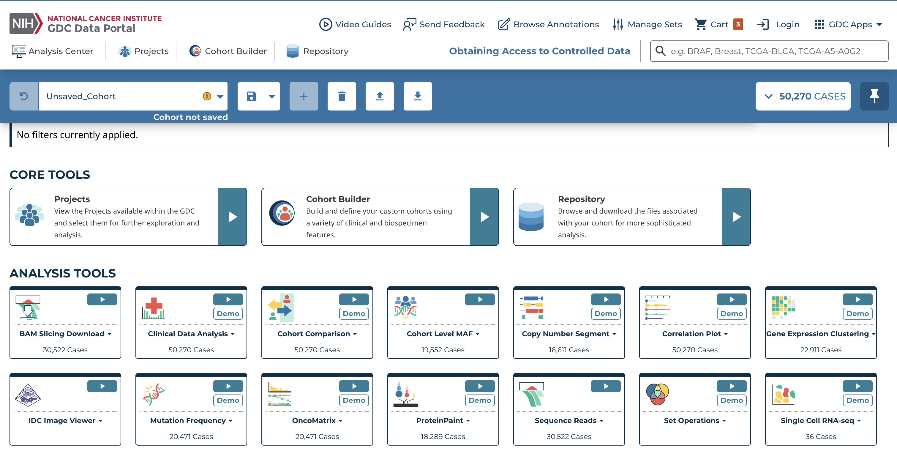
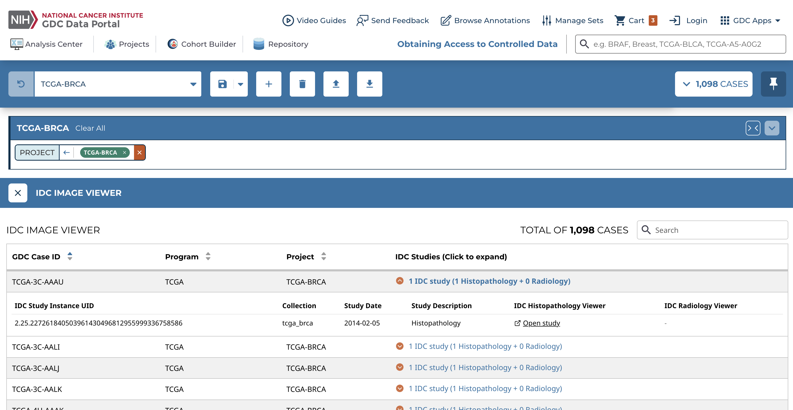
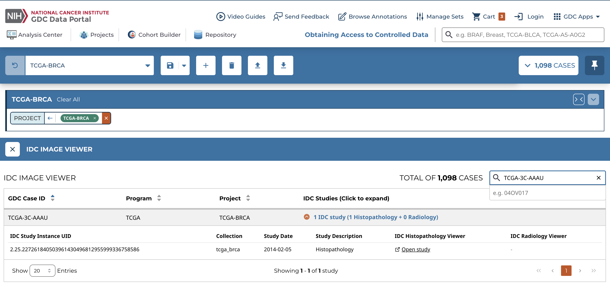

# IDC Image Viewer Tutorial

The IDC Image Viewer is an analysis tool within the GDC Data Portal that allows users to explore histopathology and radiology images from the Imaging Data Commons (IDC) for a selected cohort.

Before using the IDC Image Viewer, you can either create a cohort or use the default cohort, which includes all GDC cases.

To create a cohort in the GDC Data Portal, see [Cohort Builder](cohort_builder.md):

- Open Cohort Builder from the Data Portal header, or from the Analysis Center Cohort Builder card
- Use filter cards to narrow the current cohort to your cases of interest
- For this tutorial, select: Project -> TCGA-BRCA
- Check the active cohort in the main toolbar before continuing to IDC Image Viewer

This creates a cohort of breast cancer cases. If no filters are applied, the default cohort (all GDC cases) is used.

## Open the IDC Image Viewer

After defining your cohort:

- Click on Analysis Center
- Click on IDC Image Viewer

This will open a [table](images/idc-viewer/IDCViewer_brca_program_cohort.png).

The table includes:

- GDC Case ID
- Program (e.g., TCGA)
- Project (e.g., TCGA-BRCA)
- IDC Studies (Click to expand)

You can search for GDC cases in this table, but you must enter the full GDC Case ID, and the search is currently case-sensitive.

