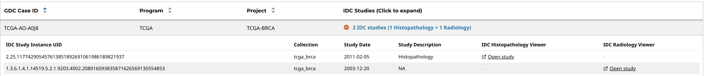

# Imaging Data Commons (IDC) Image Viewer Tutorial

The Imaging Data Commons (IDC) Image Viewer is an analysis tool within the GDC Data Portal. Researchers can use the tool to explore histopathology and radiology images for a selected cohort.

Before using the IDC Image Viewer, a user can either create a cohort or use the default cohort, which includes all GDC cases.

To create a cohort in the GDC Data Portal, see [Cohort Builder](cohort_builder.md):

- Open Cohort Builder from the GDC Data Portal header, or from the Analysis Center Cohort Builder card
- Use filter cards to narrow the current cohort to the cases of interest
- For this tutorial, select: Project -> TCGA-BRCA
- Check the active cohort in the main toolbar before continuing to the IDC Image Viewer

This creates a cohort of breast cancer cases. If no filters are applied, the default cohort (all GDC cases) is used.

## Open the IDC Image Viewer

After defining a cohort:

- Select Analysis Center
- Select IDC Image Viewer

This will open a [table](images/idc-viewer/IDCViewer_brca_program_cohort.png).

The table includes:

- GDC Case ID
- Program (e.g., TCGA)
- Project (e.g., TCGA-BRCA)
- IDC Studies (Click to expand)

A user can search for GDC cases in this table, but the full GDC Case ID must be entered, and the search is currently case-sensitive.

Each GDC case includes a list of associated IDC studies. To view them, select the **IDC Studies** link to expand the row in the table.

For case **TCGA-3C-AAAU**, the IDC Study Instance Unique Identifier (UID) is:

`2.25.227261840503961430496812955999336758586`

To view the corresponding histopathology images in IDC, select [**Open Study**](https://viewer.imaging.datacommons.cancer.gov/slim/studies/2.25.227261840503961430496812955999336758586/).

Some GDC cases may have multiple associated studies. For example, case **TCGA-AO-A0J8** can be found using search and has 2 associated studies: 1 histopathology study and 1 radiology study.

In this example, use **Open study** in the **IDC Histopathology Viewer** column to open pathology slide images, and use **Open study** in the **IDC Radiology Viewer** column to open radiology image series.

For instructions on using each viewer, see the IDC User's Guide:

- [Histopathology Viewer functionality](https://learn.canceridc.dev/portal/visualization#idc-pathology-viewer-functionality)
- [Radiology Viewer functionality](https://learn.canceridc.dev/portal/visualization#idc-radiology-viewer-functionality)
