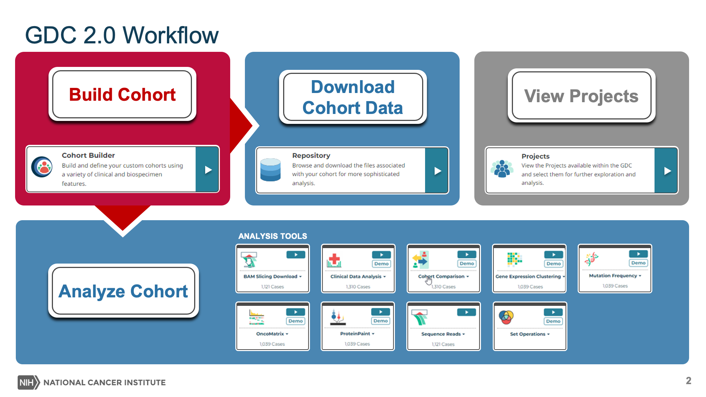

# Tutorial Videos

## Overview

The [GDC Data Portal 2.0](https://portal.gdc.cancer.gov) centers around the idea of building cohorts, or groups of cases, before analyzing or downloading data.

In this GDC 2.0 Video Tutorial, obtain an overview of the GDC Data Portal, learn about the GDC 2.0 workflow, and learn how to do the following:

* Build a cohort
* Analyze a cohort using GDC analysis tools
* Download data associated with a cohort
* View projects and available data in the GDC, and filter to create custom cohorts

GDC 2.0 Videos are available in the [NCI GDC YouTube Playlist](https://www.youtube.com/playlist?list=PLaXJeOudgf60aE6tqrZcIhm9B4Ivxar4a). For additional details, please see the [GDC 2.0 User's Guide](getting_started.md).

## GDC Data Portal

<table>
<tr>
<td>
The GDC Data Portal serves as a repository and computational platform, providing access to harmonized clinical and genomic data. Cancer Research Centers contribute clinical, biospecimen, and molecular data - like DNA and RNA sequences - using standardized formats set by the GDC Data Dictionary. This data undergoes a rigorous processing pipeline, ensuring that it aligns with a common reference genome before being made available for analysis.
 
 
To access this vital resource, visit the <a href="https://portal.gdc.cancer.gov">GDC Data Portal</a>.
 
 
In this video, obtain an overview of the features of the GDC Data Portal, the portal layout, and workflow.

</td>

<td><iframe width="400" height="300" src="https://www.youtube.com/embed/7zJCYd0grbU" frameborder="0" allow="autoplay; encrypted-media" allowfullscreen> </iframe>

</td></tr>
</table>

## Build Cohort

<table>
<tr>
<td>
Cohorts are created using the <b>Cohort Builder</b>, which allows users to specify cases with custom filters for things like disease characteristics, patient demographics, data type, and more.
 
 
In this video, learn how to use the <b>Cohort Builder</b> to build a cohort of patients with lung cancer, that are over the age of 50, and have harmonized RNA-Seq data.
</td>

<td><iframe width="400" height="300" src="https://www.youtube.com/embed/ppEYuxbarGw" frameborder="0" allow="autoplay; encrypted-media" allowfullscreen> </iframe>

</td></tr>
</table>

## Analyze Cohort

### Analysis Center

<table>
<tr>
<td><iframe width="400" height="300" src="https://www.youtube.com/embed/N2my3pTtSiU" frameborder="0" allow="autoplay; encrypted-media" allowfullscreen> </iframe>
</td>
<td>
Once a cohort is created, the cohort can be analyzed using an analysis tool in the <b>Analysis Center</b>.
 
 

In this video, learn how to analyze a cohort in the <b>Analysis Center</b>. Instructional videos are available for each analysis tool.

</td>
</tr>
</table>

### Analysis Tools

A cohort can be analyzed by selecting an analysis tool in the Analysis Center. The GDC provides analysis tools for performing both gene-level variant analysis and clinical data analysis. The table below identifies and describes each tool, and provides video instruction.

<table>
<tr><td><b>Tool</b></td> <td><b>Description</b></td><td><b>Video</b></td></tr>

<tr>
<td><b>Clinical Data Analysis</b></td>
<td>Use clinical variables to perform basic statistical analysis of your cohort</td>
<td><iframe width="240" height="160" src="https://www.youtube.com/embed/0DuI4NEQ6CU" frameborder="0" allow="autoplay; encrypted-media" allowfullscreen > </iframe>
</td>
</tr>
<tr>
<td><b>Cohort Comparison</b></td>
<td>Display the survival analysis of your cohorts and compare characteristics such as gender, vital status and age at diagnosis</td>
<td><iframe width="240" height="160" src="https://www.youtube.com/embed/NT7-TB78VjA" frameborder="0" allow="autoplay; encrypted-media" allowfullscreen > </iframe>
</td>
</tr>
<tr>
<td><b>Cohort Level MAF</b></td>
<td>Download an aggregated set of variants in MAF format based on the cases in your active cohort.</td>
<td><iframe width="240" height="160" src="https://www.youtube.com/embed/4megNwrPsbs" frameborder="0" allow="autoplay; encrypted-media" allowfullscreen > </iframe>
</td>
</tr>
<tr>
<td><b>Gene Expression Clustering</b></td>
<td>Display gene expression visualization </td>
<td><iframe width="240" height="160" src="https://www.youtube.com/embed/f58U6hL4Wok" frameborder="0" allow="autoplay; encrypted-media" allowfullscreen > </iframe>
</td>
</tr>
<tr>
<td><b>Mutation Frequency</b></td>
<td>Visualize most frequently mutated genes and somatic mutations</td>
<td><iframe width="240" height="160" src="https://www.youtube.com/embed/dbbuk-zhmvc" frameborder="0" allow="autoplay; encrypted-media" allowfullscreen > </iframe>
</td>
</tr>
<tr>
<td><b>OncoMatrix</b></td>
<td>Visualize the top most mutated cases and genes affected by high impact mutations in your cohort</td>
<td><iframe width="240" height="160" src="https://www.youtube.com/embed/ZgSeJCqLmzY" frameborder="0" allow="autoplay; encrypted-media" allowfullscreen > </iframe>
</td>
</tr>
<tr>
<td><b>ProteinPaint</b></td>
<td>Visualize mutations in protein-coding genes by consequence type and protein domain</td>
<td><iframe width="240" height="160" src="https://www.youtube.com/embed/5AXvhtFd_Es" frameborder="0" allow="autoplay; encrypted-media" allowfullscreen > </iframe>
</td>
</tr>
<tr>
<td><b>Sequence Reads</b></td>
<td>Visualize sequencing reads for a given gene, position, SNP, or variant</td>
<td><iframe width="240" height="160" src="https://www.youtube.com/embed/PkQ6cEzRCds" frameborder="0" allow="autoplay; encrypted-media" allowfullscreen > </iframe>
</td>
</tr>
<tr>
<td><b>Set Operations</b></td>
<td>Display a Venn diagram and compare/contrast your cohorts or sets of the same type</td>
<td><iframe width="240" height="160" src="https://www.youtube.com/embed/QHJwyL_pLak" frameborder="0" allow="autoplay; encrypted-media" allowfullscreen > </iframe>
</td>
</tr>
<tr>
<td><b>BAM Slicing</b></td>
<td>Slice a specific region, gene, or chromosome from a GDC-harmonized BAM file.</td>
<td><iframe width="240" height="160" src="https://www.youtube.com/embed/Nd9Ex9s_prk" frameborder="0" allow="autoplay; encrypted-media" allowfullscreen > </iframe>
</td>
</tr>
<tr>
<td><b>Single Cell RNA-Seq Tool</b></td>
<td>Visualize single-cell RNA-Seq data with cluster plots and gene expression overlays.</td>
<td><iframe width="240" height="160" src="https://www.youtube.com/embed/YFuACn7Jgkk" frameborder="0" allow="autoplay; encrypted-media" allowfullscreen > </iframe>
</td>
</tr>
</table>

## Download Cohort Data

<table>
<tr>
<td>
Genomic, clinical, and biospecimen data associated with a cohort can be downloaded using the <b>Repository</b>.
 
 
In this video, learn how to download data associated with a cohort in the <b>Repository</b>.
</td>
<td><iframe width="400" height="300" src="https://www.youtube.com/embed/edipjoF1Tyk" frameborder="0" allow="autoplay; encrypted-media" allowfullscreen> </iframe>
</td>
</tr>
</table>

## View Projects

<table>
<tr>
<td><iframe width="400" height="300" src="https://www.youtube.com/embed/rKn2WJuA850" frameborder="0" allow="autoplay; encrypted-media" allowfullscreen> </iframe>
</td>
<td>

GDC data is organized by projects within a larger cancer research program. Projects are generally composed of a particular type of cancer, such as the low-grade glioma (LGG) and sarcoma (SARC) projects within the TCGA program.
 
In this video, learn how to use The GDC Data Portal to access project-level information via the Projects tool and Project Summary Page and navigate and filter data to create custom cohorts.
</td>
</tr>
</table>
