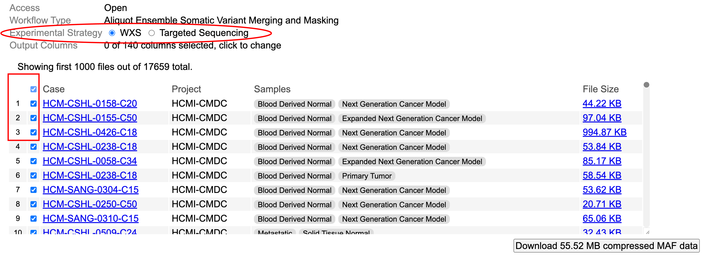
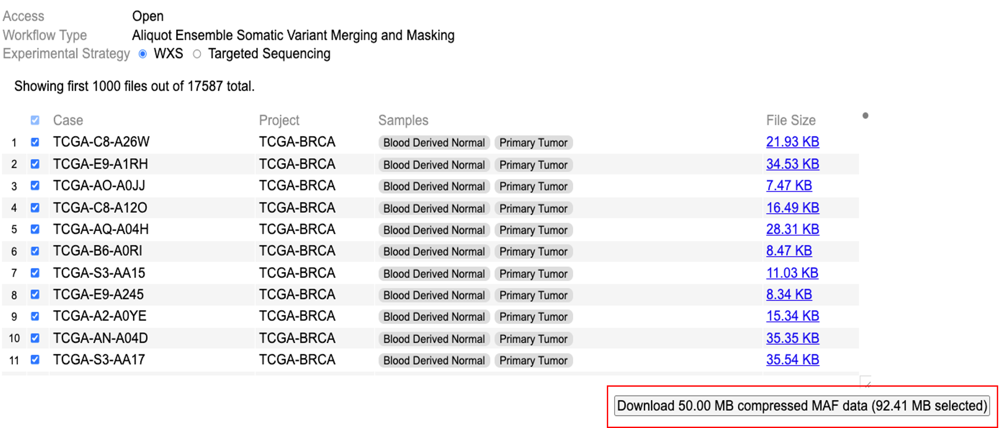

# Cohort MAF

## Introduction to Cohort Level MAF
The Cohort Level MAF tool is a web-based tool for searching and selecting a desired set of open-access Mutation Annotation Format (MAF) files from the NCI Genomic Data Commons (GDC), and downloading the aggregated and compressed file. 

## Downloads

### Data Query

To retrieve all open-access MAF files with the specified workflow type, select an experimental strategy by clicking either 'WXS' or 'Targeted Sequencing'. Users can then visualize all MAF files with the chosen experimental strategy. Users may choose MAF files by selecting the rows for cases of interest as shown in the table.

### Data Download

To download all selected files, click the button in the bottom right corner of the screen, which displays the total size of the download. These files are aggregated, sorted, compressed, and downloaded to the browser or the 'Downloads' folder.

