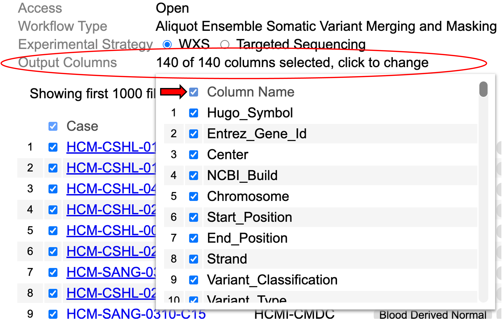

# Cohort Level MAF

## Introduction to Cohort Level MAF
The Cohort Level MAF tool is a web-based tool for searching and selecting a desired set of open-access Mutation Annotation Format (MAF) files from the NCI Genomic Data Commons (GDC), and downloading the aggregated and compressed file. 

## Downloads

### Data Query

To retrieve all open-access MAF files with the specified workflow type, select an experimental strategy by clicking either 'WXS' or 'Targeted Sequencing'. Users can then visualize all MAF files with the chosen experimental strategy. Users may choose MAF files by selecting the rows for cases of interest as shown in the table.

Additionally, user can specify the column headers in the downloaded MAF files. To do so, click the highlighted label '0 of 140 columns selected, click to change'. This shows a list with checkboxes to make selections. Select all by clicking the checkbox next to 'Column Name' or make individual selections.

After all selections are made, the files are ready for download.

### Data download

A button in the bottom right corner of the screen displays the total size of all selected file. To download all selected files, click the button as shown. These files are aggregated, sorted, compressed, and downloaded to the browser or the 'Downloads' folder.

