# Correlation Plot

The Correlation Plot is a framework to correlate GDC molecular information (mutation, CNV, gene expression) with patient clinical and survival data.

## Launch Correlation Plot

At Analysis Center, select the "Correlation Plot" card.

[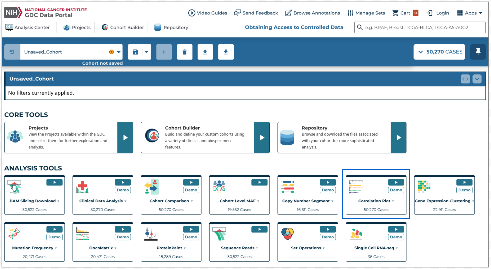](images/correlation/1.png "Click to see the full image.")

This displays an interface for generating correlation plot.

[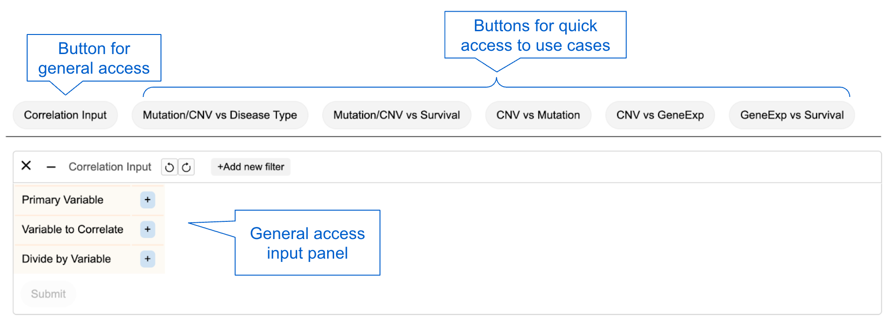](images/correlation/2.png "Click to see the full image.")

In all illustrated examples, the cohort filter "Primary\_site IS Brain OR Breast" is used.

## General Access

Clicking the "Correlation Input" button will display the general access panel with three input choices to select data variables and launch the chart.
Only "Primary Variable" is required and the other two choices are optional. 

As a simple example, click the prompt button of Primary Variable to show the variable selection interface. From this interface, select "Disease type" variable, which will allow it to populate the Primary Variable, and activate the Submit button. Click the Submit button to launch a barchart showing a breakdown of disease type breakdown in the current cohort.

[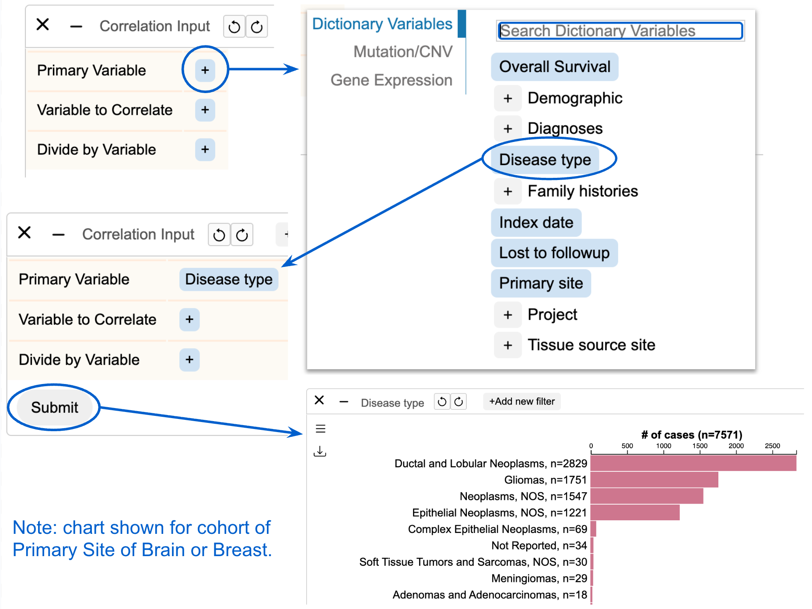](images/correlation/3.png "Click to see the full image.")

The variable selection interface has toggling tabs on the left for choosing between variables of different modalities. This interface is shown for Primary Variable, Variable to Correlate, and Divide by Variable. This allows users to select any combination of clinical variables, survival, gene mutation, CNV, and expression into a plot to compare their correlation.

Using the same interface, select two variables to correlate their sample values. As an example, following selection of Disease Type as Primary Variable, click prompt button for Variable to Correlate. At the new panel, click the "Mutation/CNV" tab. At the gene search box, search for gene "IDH1". Submit to see a new barchart with IDH1 mutation status overlaid on disease types. Compared to the Disease type barchart in above example, this barchart has fewer number of cases, due to the use of gene mutation variable that excluded cases without DNA sequencing.

[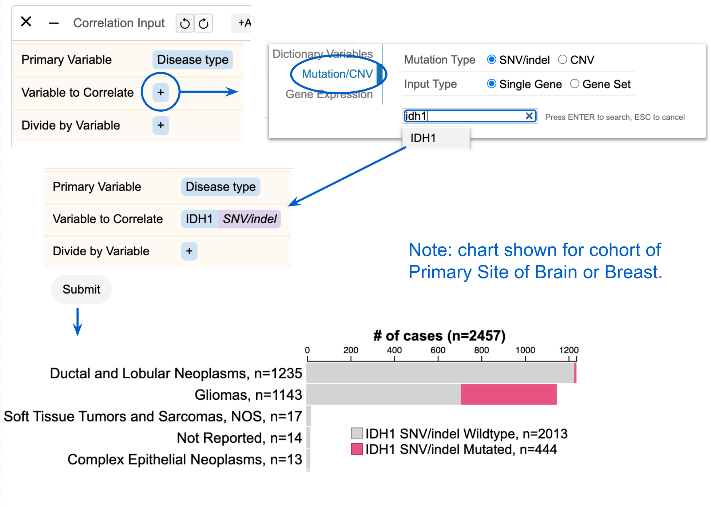](images/correlation/4.png "Click to see the full image.")

## Mutation/CNV vs Disease Type

This quick access button compares mutation or CNV status of a gene with a clinical variable such as disease type. Click this button to open an input panel. To launch the plot using the default configuration, simply search for a gene. On finding a valid gene, a barchart opens showing disease breakdown from the current cohort.

[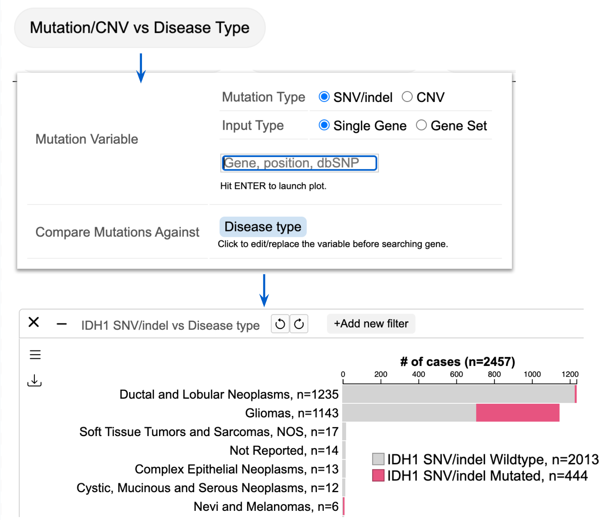](images/correlation/5.png "Click to see the full image.")

Correlation Plot allows grouping the disease types for correlation. To do so, at the input interface, click on Disease type button, select the Edit option. A new interface displays allowing to assign disease categories to groups. As example, drag Gliomas to the second group, and rename each group and click Apply button. This allows generating a barchart of two groups.

[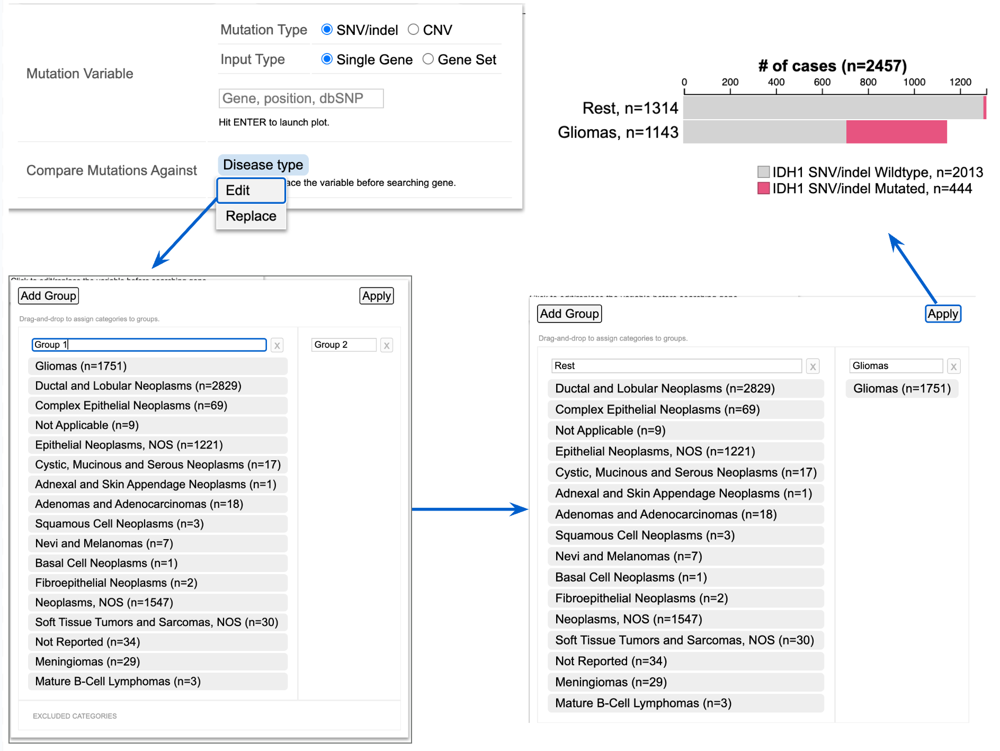](images/correlation/6.png "Click to see the full image.")

To select a different clinical variable, at the input interface, click on the Disease type button, select the Replace option to find another variable.

To correlate gene CNV status with Disease type, at the input interface, before searching gene, select the CNV option. In this example, the barchart correlates EGFR gene CNV status with Disease type.

[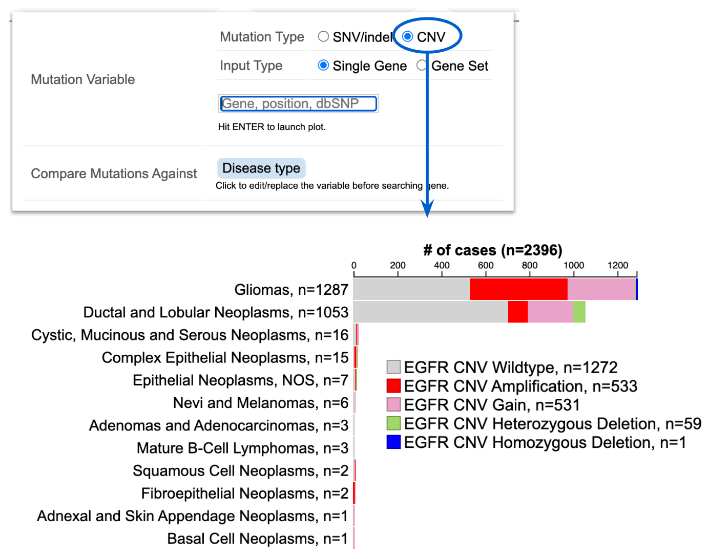](images/correlation/7.png "Click to see the full image.")

To use gene set for mutation, at the input panel select "Gene Set". As an example, create a gene set with two genes EGFR and IDH1 that can generate a barchart overlaying a mutation variable that selects cases with mutation in either gene in the Mutated group (pink).
[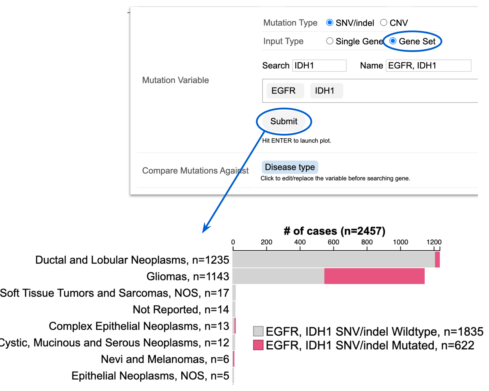](images/correlation/8.png "Click to see the full image.")

## Mutation/CNV vs Survival

This quick access button compares gene mutation or CNV status with survival. At the input panel, searching for gene IDH1 will generate a Kaplan-Meier plot comparing survival between IDH1 mutated and wildtype groups. Gene CNV and gene set mutation can be applied the same way as Mutation/CNV vs Disease Type.
[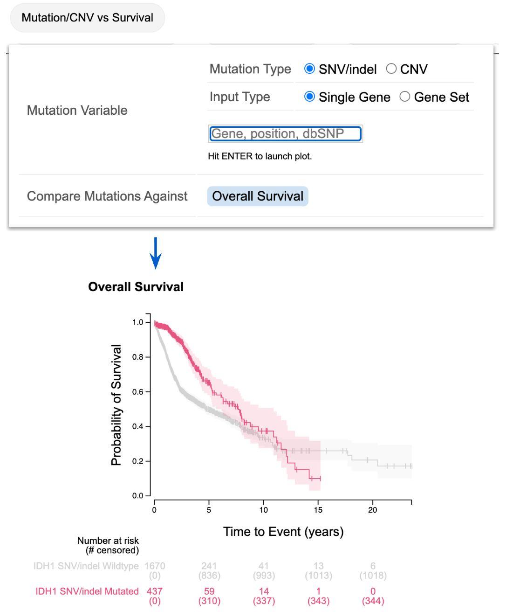](images/correlation/9.png "Click to see the full image.")

## CNV vs Mutation

This compares CNVs and mutations for given genes. At the input panel, search for gene EGFR to launch a barchart showing EGFR mutation status as rows, and EGFR CNV status as overlays.
[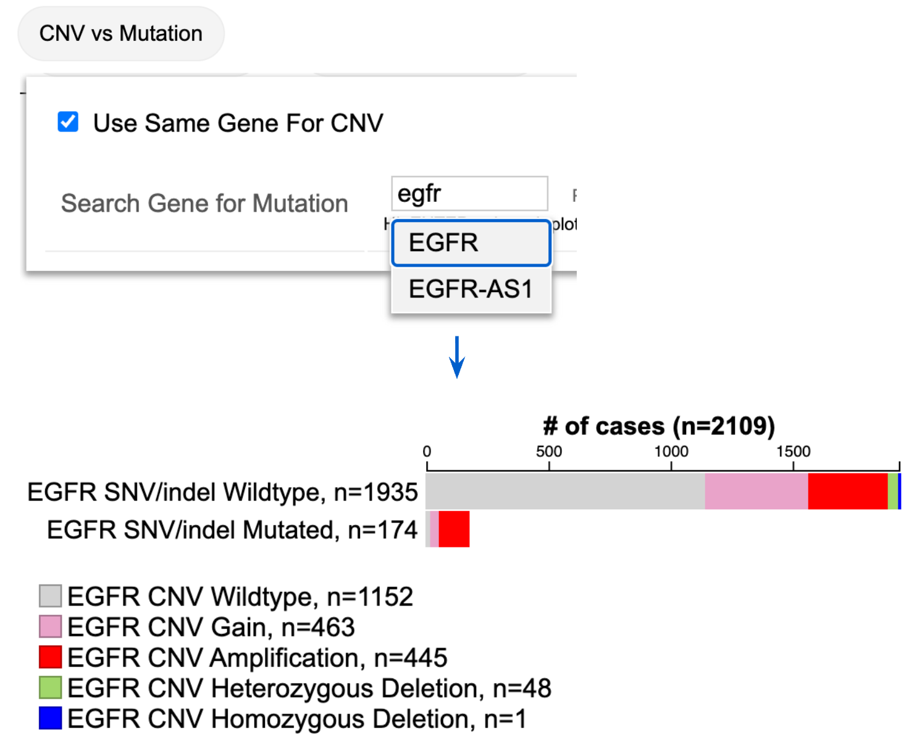](images/correlation/10.png "Click to see the full image.")

This plot compares mutations and CNVs of two genes. At input panel, uncheck the checkbox for "Use Same Gene For CNV". Then enter two gene names at each search box and click Launch button to display a barchart comparing mutations and CNVs for two genes.
[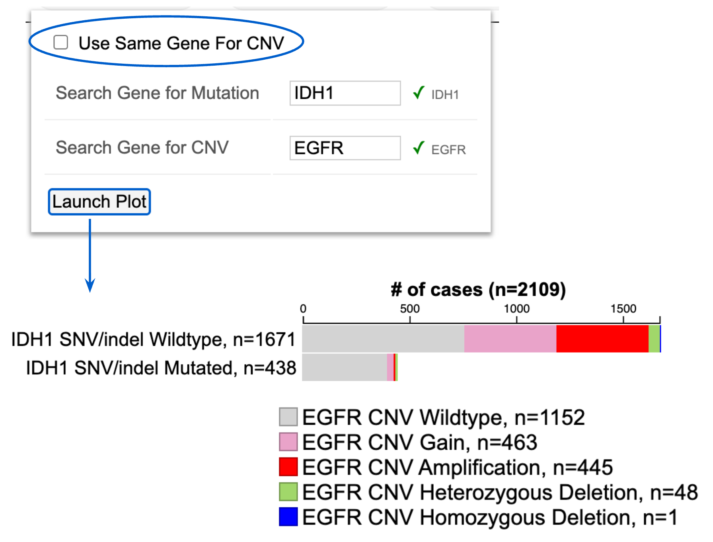](images/correlation/11.png "Click to see the full image.")

## CNV vs Gene Expression

This compares a gene's CNV with its expression. At the input panel, enter gene EGFR to open a violin plot of EGFR gene expression, comparing across cases with different EGFR CNV status. As in other plots, CNV and expression of two different genes can be compared in this plot.
[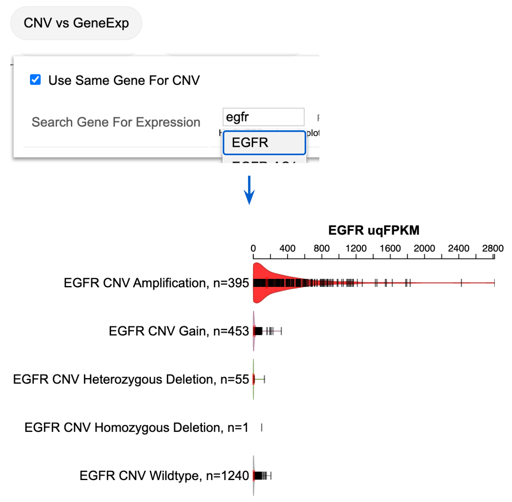](images/correlation/12.png "Click to see the full image.")

## Gene Expression vs Survival

This compares gene expression level with survival. At the input panel, search for gene EGFR, it launches a Kaplan-Meier plot comparing survival between three groups of cases, with different EGFR expression level, or cases with missing gene expression data.
[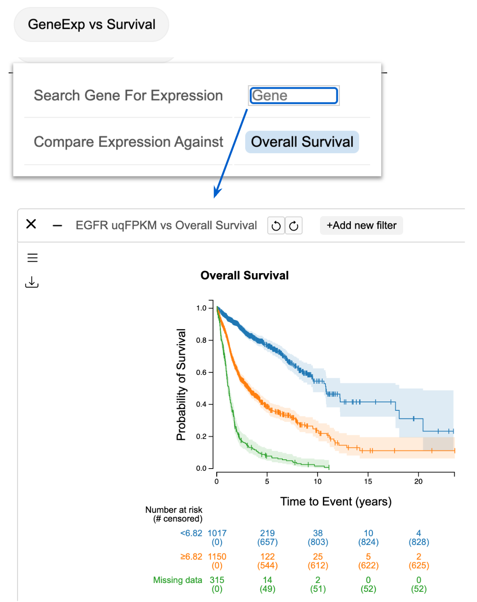](images/correlation/13.png "Click to see the full image.")

A default FPKM-UQ cutoff (6.82) is applied to discretize EGFR expression. To customize the cutoff, click the burger menu button at the top left to access options to customize survival plot. Find the "EGFR uqFPKM" tag. Click and select Edit option to open the EGFR expression binning edit menu. At the text box, change the existing cutoff 6.82 to a new value and press ENTER. As example, two values 10 and 30 are entered, allowing samples to be divided into 3 bins based on their EGFR expression value: <=10, 10 to 30, \>30.
[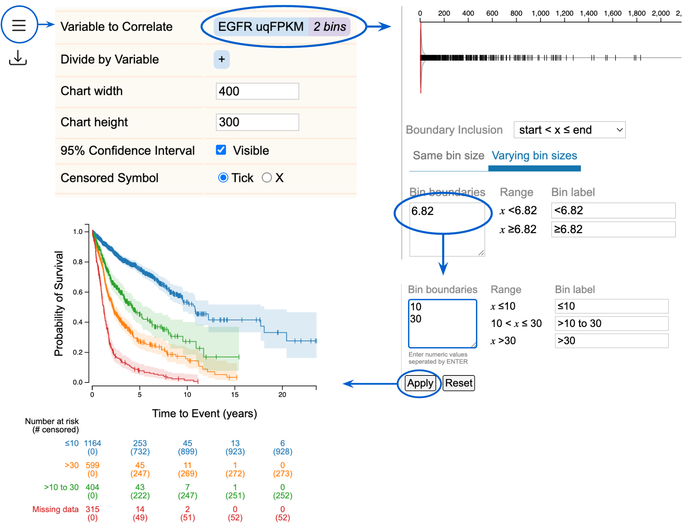](images/correlation/14.png "Click to see the full image.")

