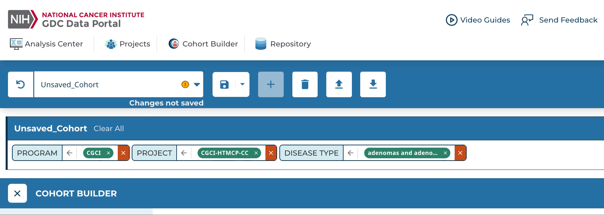
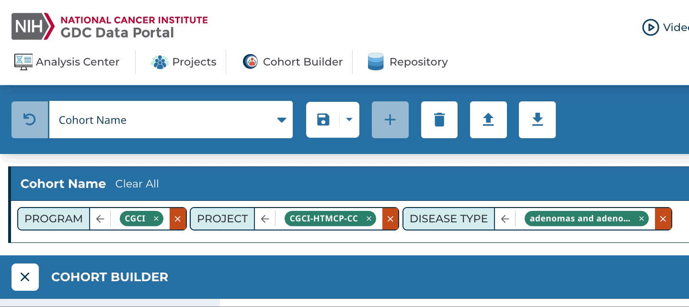
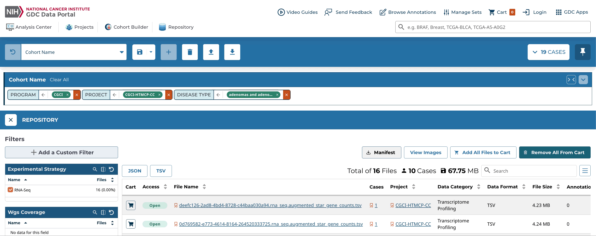
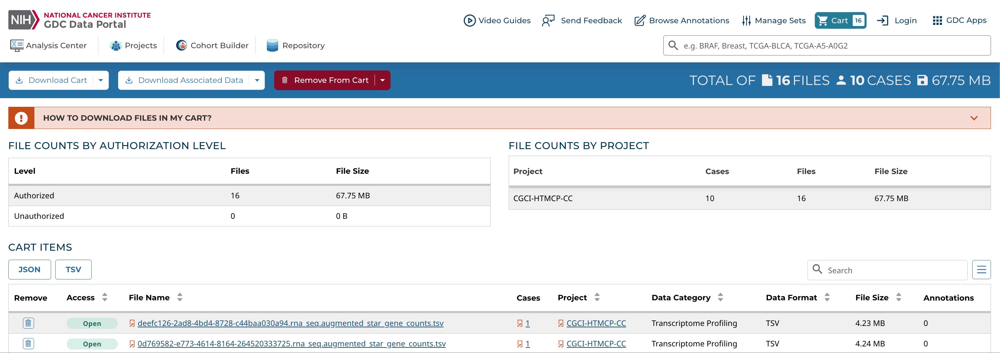
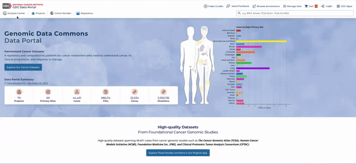
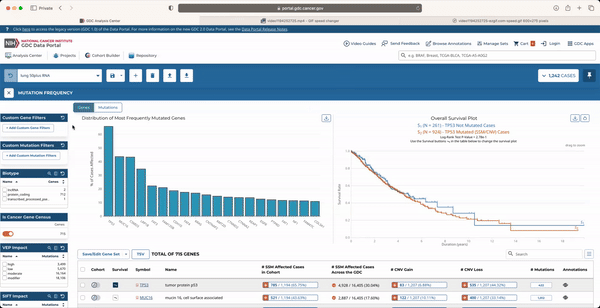
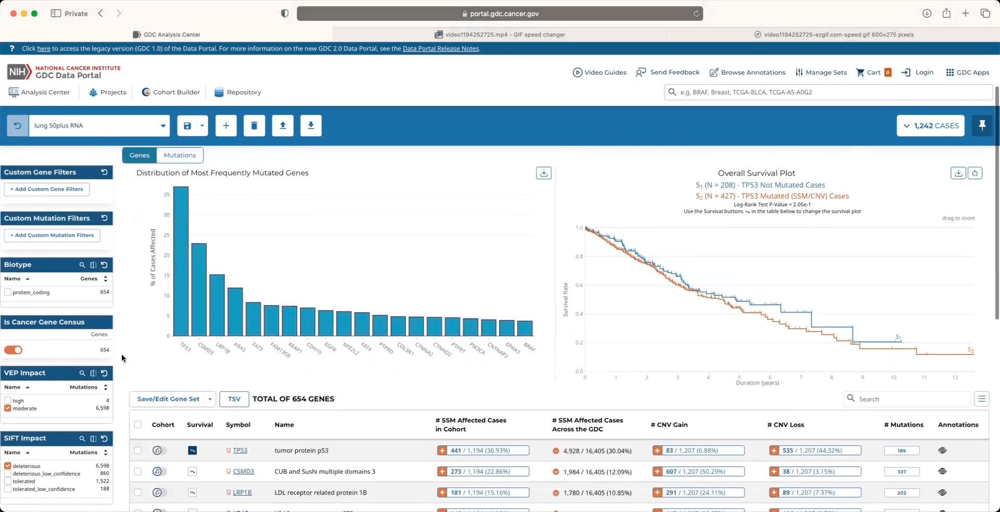
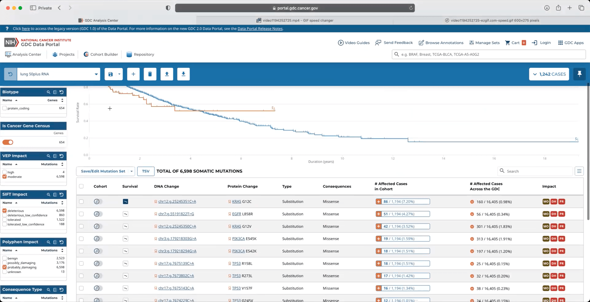

# Quick Start Page

The purpose of this guide is to quickly introduce researchers to the GDC Data Portal. This is not a comprehensive overview of the Data Portal and may not contain details for your specific use-case. Please see the rest of the Data Portal documentation pages for information about specific tools.

Start at [https://portal.gdc.cancer.gov/](https://portal.gdc.cancer.gov/).

### Building and Analyzing a Cohort

__Step 1:__ Go to the Cohort Builder at the top left of the Data Portal.

??? note "Click to Expand/Collapse Animation"

    

__Step 2:__ Use the filters in the Cohort Builder to filter down the full set of GDC cases to a subset you are interested in. Filter categories can be selected in the left panel.

??? note "Click to Expand/Collapse Animation" 

    

__Step 3:__ Save your cohort by clicking the "Save" icon in the cohort bar, choosing "Save", and naming your cohort when prompted.

??? note "Click to Expand/Collapse Animation"

    

__Step 4:__ The cohort you created is now your active cohort.  Go to the Analysis Center at the top left of the Data Portal.  Choose the tool you would like to use from the list.  The analysis will apply to the data from your cohort.

??? note "Click to Expand/Collapse Animation"

    

### Downloading Files

__Step 1:__ Select your cohort of interest, [create one](#building-and-analyzing-a-cohort) if you have not already.

??? note "Click to Expand/Collapse Animation"

    

---

__Step 2:__ Go to the Repository tool from the Analysis Center or the top left of the portal.

??? note "Click to Expand/Collapse Animation"

    

---

__Step 3:__ The Repository tool will display files that are associated with the cases in your active cohort. Narrow down your file selection by filtering them using the panel on the left.

??? note "Click to Expand/Collapse Animation"

    

---

__Step 4:__ When you are done filtering, add the files to your cart.  Then go to the cart.

??? note "Click to Expand/Collapse Animation"

    

---

__Step 5:__ The files in the cart can be downloaded directly from the browser or a manifest can be downloaded and passed to the [GDC Data Transfer Tool](/Data_Transfer_Tool/Users_Guide/Getting_Started/).

??? note "Click to Expand/Collapse Animation"

    

### Viewing Mutations

__Step 1:__ Select your cohort of interest or [create one](#building-and-analyzing-a-cohort) if you have not already.

??? note "Click to Expand/Collapse Animation"

    

---

__Step 2:__ Launch the Mutation Frequency tool from the Analysis Center.

??? note "Click to Expand/Collapse Animation"

    

---

__Step 3:__ The Mutation Frequency tool visualizes the most frequently mutated genes and the most frequent somatic mutations for the active cohort. Narrow down your results by filtering them using the panel on the left.

??? note "Click to Expand/Collapse Animation"

    

---

__Step 4:__ To view the most frequent somatic mutations, navigate to the Mutations tab.

??? note "Click to Expand/Collapse Animation"

    

---

__Step 5:__ The mutation table can be downloaded by clicking on the TSV button at the top of the table.

??? note "Click to Expand/Collapse Animation"

    
