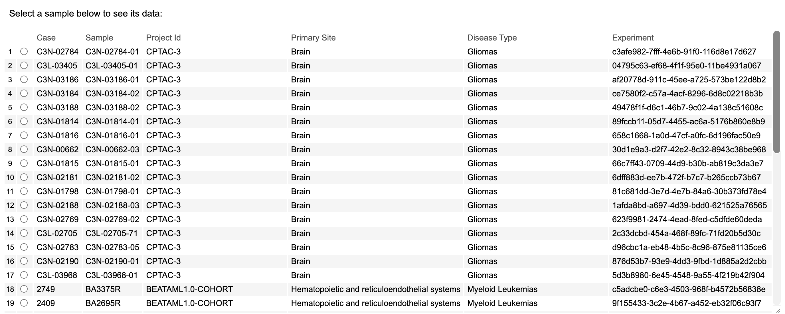
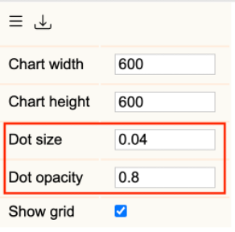
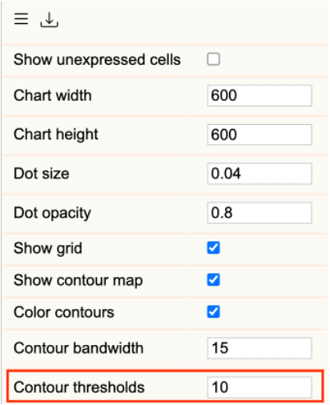

# GDC Single Cell RNA Visualization User Guide

## Introduction

The single cell visualization platform facilitates the analysis of single cell RNA sequencing data with cluster plots and gene expression overlays.

## Overview of the Platform

The platform is divided into four primary tabs:

* **Samples Tab** - For initial sample selection.
* **Plots Tab** - For dimensionality reduction visualization and population analysis.
* **Gene Expression Tab** - For examining individual gene expression patterns across clusters.
* **Differential Expression (DE) Tab** - For comparative analysis between clusters to find potential biomarkers. It splits into two sub-tabs:
  * **Differentially Expressed Genes Tab** - Allows the selection of a cluster and comparison of gene expression in that cluster to all other cells.
  * **Gene Set Enrichment Analysis (GSEA) Tab** - For identifying enriched or depleted pathways using multiple enrichment gene sets, including those from Reactome, Wikipathways, etc.
* **Summary Tab** - Displays the distribution of the expression of a particular gene of interest across clusters, along with pairwise comparisons between clusters and descriptive statistics.

Each tab provides specific tools for data exploration and statistical analysis, enabling reproducible single-cell data interpretation.

## Accessing the Tool

The Samples tab enables sample selection and initial data exploration. A case consists of an experimental dataset containing:

* **Case**
* **Sample**
* **Project ID**
* **Primary Site**
* **Disease Type**
* **Experiment**

### Sample Selection Procedure:

1. Navigate to the Sample tab.
2. Select a sample from the available datasets.
3. The system automatically generates a Uniform Manifold Approximation and Projection (UMAP) visualization.
4. The UMAP plot appears in the Plots tab, displaying cellular relationships through dimensional reduction.

For example, select sample '2409':
* A UMAP visualization is rendered, with all cells shown as individual points on a 2-D plot.
* Clusters represent distinct cell populations.

The different dimensionality reduction visualizations serve as the foundation for subsequent analysis through the Gene Expression and Differential Expression tabs.

## Features

### The Basics of Plots

The specific sample you selected presents the UMAP visualization as an interactive scatter plot with the following features. These features are available in all plots, including UMAP, t-SNE, and PCA.

#### Initial Visualization Properties:

* Each point represents a single cell from the dataset.
* Point positions reflect closeness or distance in cellular similarities.
  * Points closer together may indicate shared characteristics.
  * Distant points may suggest biological differences.
* Color-coding distinguishes cellular clusters.
  * Each color represents a distinct cell population or subtype.
  * Groups clustered together may indicate common or overlapping features.

#### Navigation Controls:

* **Zoom Functionality**
  * Mouse scroll wheel adjusts plot scale.
  * Zoom controls (+/-) located in the left panel.
  * Higher magnification reveals detailed cluster boundaries.
  * Lower magnification shows global population distribution.
* **Pan Controls**
  * Click and drag repositions the view.
  * Enables focused examination of specific regions.
  * Maintains zoom level during position adjustment.
* **View Reset**
  * Reset button in the left panel restores default view.
  * Returns plot to original scale and position.
* **Hide/Show Controls**
  * Clicking on the legend text presents options to show or hide specific clusters.
  * Showing or hiding only a specific cluster is also supported.

* **Download Controls**
Clicking the download button as shown starts the download.
Both a .png of the plot of interest and a .svg of the legend of the plot are downloadable as separate files.

The default view configuration ensures optimal initial visualization of all cells while enabling detailed exploration through navigation controls. These controls apply to other plot types such as t-SNE and PCA.

### Customizing the Plots

The Plots tab provides visualization parameters accessible through the configuration menu in the left panel:

#### Display Parameters:

* **Chart Dimensions**
  * Width adjustment controls horizontal plot size.
  * Height adjustment controls vertical plot size.
  * Values specified in pixels.

* **Dot Size Configuration**
  * Controls diameter of cells.
  * Range: 0.01 to 0.1.
  * Smaller values: Reveal fine population boundaries.
  * Larger values: Emphasize individual cells.

* **Dot Opacity Configuration**
  * Controls transparency of cells.
  * Range: 0.1 to 1.0.
  * Lower values (0.1-0.3):
    * Reveal density in overlapping regions.
    * Highlight population transition zones.
  * Higher values (0.4-1.0):
    * Emphasize individual cell positions.
    * Define clear cluster boundaries.

**Application Examples:**

* **Dense Population Analysis**
  * Reduce opacity (0.2-0.3).
  * Decrease point size (0.1-0.3).
  * Reveals gradient patterns in overlapping regions.
* **Rare Population Examination**
  * Increase opacity (0.7-1.0).
  * Increase point size (0.8-1.2).
  * Highlights individual cells within sparse regions.

### Dimensionality Reduction Methods

The Plots tab provides three dimensionality reduction methods:

#### Available Methods:

* **Uniform Manifold Approximation and Projection (UMAP)**
  * Visualizes both local and global relationships.
  * Preserves population structure across scales.
  * Default visualization at case loading.
* **t-Distributed Stochastic Neighbor Embedding (t-SNE)**
  * Emphasizes local cellular relationships.
  * Highlights fine population structure.
  * Optimal for detailed cluster analysis.
* **Principal Component Analysis (PCA)**
  * Displays primary sources of variation.
  * Reveals underlying data patterns.
  * Presents variance distribution across components.

**Note:**
To display a certain plot type, check its respective box. You can examine each plot separately. When multiple plot types are open, they can be viewed simultaneously. You can use the "Basics of Plots" section controls in all three dimensionality reduction plot types.

**Comparative Analysis:**

* **UMAP and t-SNE Comparison**
  * Similar cluster patterns.
  * Complementary structural details.
  * Validates population identification.
* **PCA Integration**
  * Provides orthogonal analysis perspective.
  * Highlights variance-driven relationships.
  * Confirms population distinctions.

### Investigating Gene Expression

To investigate gene expression across cells, click on the Gene Expression tab. Users can initiate gene queries through the search field, which provides dynamic suggestions based on input. Following gene selection, the plot updates to display expression levels of that gene across the cells in the selected sample.

#### Color Scale Configuration

Users can configure the color of the expression legend through the minimum and maximum selectors when clicking on the color bar. For both the min and max, the tab presents a color selection window enabling precise control of the color and hue that are selected. A user can also select Automatic, Fixed, or Percentile to set the min and max.

### Contour Features

The Plots tab provides density analysis through contour mapping accessible in the configuration menu:

#### Contour Map Parameters:

* **Show Contour Map**
  * Located in the configuration menu after entering a gene in the Gene Expression tab.
  * Toggles density-based contour map. The contours are weighted by the gene expression values of each point. This allows the contour to visualize regions of high expression.
  * The default is to have the contours turned off. They can be enabled by checking the "show contour map" checkbox.

Here we show the contour map of FLT3 in sample 2321.

* **Color Contour Options**
  * Enable colored contours via "Color Contours" toggle.

Here we show the colored contours of FLT3 in sample 2321.

* **Contour Bandwidth Options**
  * Control the resolution of the contour map.
  * The default is 15.
  * Smaller values capture more data variation and therefore make a more detailed map.
  * Larger values smooth out the lines by taking into account a wider range of data and focusing less on the nuances of the data variation.

* **Contour Threshold Options**
  * Control the density of the coloring of the contours.
  * The default threshold value is 10.
  * Smaller values make the coloring less dark.
  * Larger values make the coloring darker.

#### Analysis Applications:

* **Population Center Detection**
  * Dense regions appear with concentrated contour lines.
  * Reveals primary cluster locations.
  * Identifies population boundaries.
* **Transition Analysis**
  * Gradual contour spacing indicates population transitions.
  * Highlights regions between distinct clusters.
  * Reveals subtle biological state changes.
* **Rare Population Identification**
  * Sparse contours indicate low-density regions.
  * Helps locate isolated cell populations.
  * Distinguishes rare cell types from artifacts.

### Differential Expression Analysis (DE)

The DE analysis calculates the top genes that are differentially expressed between clusters based on certain parameters. In the Differential Expression tab, a cluster can be selected to compare the genes that have been differentially expressed between the selected cluster and all other cells in the sample. A table filtered on the basis of both log fold change and FDR is returned with the differentially expressed genes sorted by log2 fold-change (log2FC). Genes can be selected to display their expression levels across all cells in that sample.

### Gene Set Enrichment Analysis (GSEA)

Users can examine the pathways that are most enriched in samples through the GSEA tab after a DE analysis is run. Users can select various options to refine their analysis:
*	Number of permutations (a higher number gives higher accuracy but with a longer runtime).
*	Minimum and maximum gene set size filter to control the size of the gene sets used in the analysis.
*	Filtering non-coding genes from the analysis.
*	Choosing a cutoff parameter controls whether FDR or 'top gene sets' is used as the cutoff for gene sets. Specifically, the cutoff method allows the user to set a specific number of gene sets ordered by their ascending FDR value.
*	Gene set group selector (allows selecting from multiple options including those from the Gene Ontology (GO), Reactome, WikiPathways, and hallmark gene sets). Once a Gene set group is selected, a rank plot is displayed.

### Summary Tab

To see how highly differentially expressed genes vary across clusters, users can get an overview in the **Summary tab**. This tab provides visualization parameters accessible through the configuration menu in the left panel.

Here, a violin plot is displayed, showing the distribution of the gene of interest across all clusters in the sample.

Measures of central tendency such as mean, median, variance, and others are provided, along with a table showing pairwise statistical comparisons. This comparison is performed between all clusters for the particular gene of interest, with their respective p-values (generated by the Wilcoxon Rank Sum test method). Several options to refine the violin plot visualization include:

 1. The ability to alter the orientation of the plot (horizontal or vertical).
 2. Visualizing the violin plot using different methodologies (kernel density estimation (KDE) or histogram).
 3. Symbols to represent data (ticks or circles) and the symbol size.
 4. Scale for the axis of the plot (linear or log10).
 5. Visualize data as either discrete or continuous
 6. Other options like the ability to modify the color of the violin plot fill, width, and height of the plot.

In addition, there are options to control the number of bins used to make the violin plots, how much padding is between each violin of the plot, how wide and long the plot is, and the length and width of the median symbol. There are also options to control the width and length of the symbols seen in the violins.
