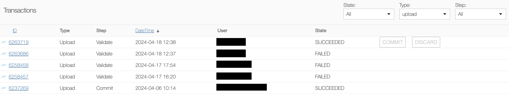
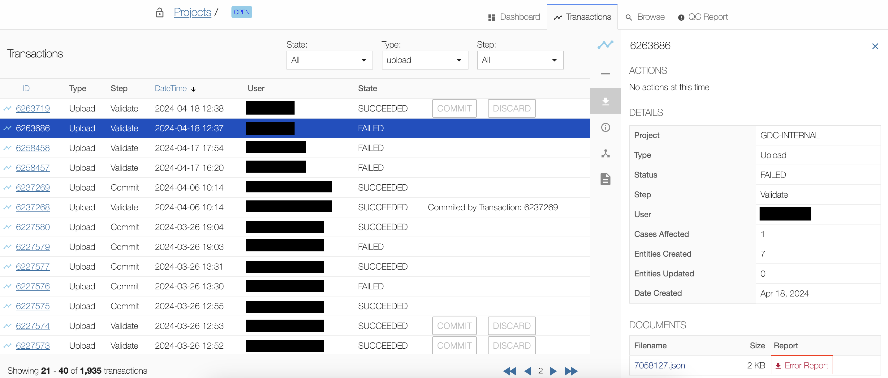
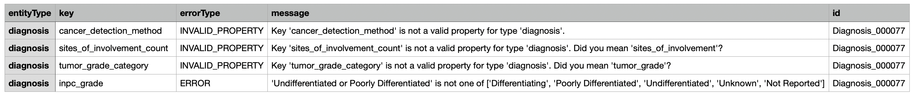

# Data Submission Troubleshooting

This guide is intended to assist in problem-solving when encountering data upload errors. Please contact the GDC Help Desk at __<support@nci-gdc.datacommons.io>__ if you have any questions or concerns regarding a submission project.

## Transactions Page

After attempting data upload, the Data Submission Portal's [transaction page](https://docs.gdc.cancer.gov/Data_Submission_Portal/Users_Guide/Data_Submission_Process/#transactions) will indicate the state of each transaction as `SUCCEEDED`, `PENDING`, or `FAILED`. 

[](images/DSP_Transaction_Page.png "Click to see the full image.")

### Transaction Details

Clicking on a failed upload will open the [details panel](https://docs.gdc.cancer.gov/Data_Submission_Portal/Users_Guide/Data_Submission_Process/#transactions-details), which includes a Documents section containing an Error Report. 

[](images/DSP_Transaction_Details.png "Click to see the full image.")

## Error Report

The Error Report is generated in tab-delimited format and describes the reason(s) that the transaction was not successful.

### Error Report Table

The Error Report table displays the following information:

|Column|Description|
| --- | --- |
| __entityType__ | Entity type that caused the error |
| __key__ | Property that caused the error|
| __errorType__ | The type of error |
| __message__ | Detailed description of the error |
| __id__ | UUID of the errored entity |

[](images/DSP_Error_Report.png "Click to see the full image.")

### Data Upload Error Messages

Each error type can have numerous error messages which are detailed in the following sections. If data upload is attempted through the API, the command line output will indicate whether the transaction was successful or failed, and, if applicable, the same error message(s) that would be included in the Data Submission Error Report.

#### ERROR Messages

|Message|Explanation|Solution|
| --- | --- | --- |
| __'{Value}' is not one of [{acceptable values}]__ | The value is not accepted by the GDC for the designated property | Ensure the property value is acceptable by reviewing the [GDC Data Dictionary](https://docs.gdc.cancer.gov/Data_Dictionary/viewer/) |
| __'{Entity}' with {'project_id': '{project_id}', 'submitter_id': '{entity submitter_id}'} already exists in the GDC__ | An entity with that submitter_id has already been uploaded to the designated project | Ensure the submitter_id is unique to the project |
| __Additional properties are not allowed ('{property}' or '{list of properties}') was/were unexpected__ | The given property or properties are not accepted for the designated entity | Ensure entity accepts the properties by reviewing the [GDC Data Dictionary](https://docs.gdc.cancer.gov/Data_Dictionary/viewer/) |
| __{value} is less than the minimum of -32872__ | The amount is less than the minimum accepted value | Ensure the value is greater than or equal to the minimum value and view the best practices section on [Date Obfuscation](https://docs.gdc.cancer.gov/Data_Submission_Portal/Users_Guide/Best_Practices/#date-obfuscation) if applicable |

Example 1:
```Request1
{ 
  "submitter_id": "Diagnosis_000093",
  "tissue_or_organ_of_origin": "Abdomen, NOS",
  "primary_diagnosis": "Adenoma, NOS", 
  "morphology": "8000/9", 
  "type": "diagnosis", 
  "cases": {
    "submitter_id": "GDC-INTERNAL-000093"
  }, 
  "age_at_diagnosis": 35, 
  "diagnosis_is_primary_disease": true, 
  "site_of_resection_or_biopsy": "Abdomen, NOS",
  "gleason_grade_group": "Group 6"
}
```
```Response1
{
  "cases_related_to_created_entities_count": 1,
  "cases_related_to_updated_entities_count": 0,
  "code": 400,
  "created_entity_count": 0,
  "entities":
    [
        {
            "action":"create",
            "errors":
                [
                    {
                        "keys":["gleason_grade_group"],
                        "message":"'Group 6' is not one of ['Group 1', 'Group 2', 'Group 3', 'Group 4', 'Group 5', 'Unknown', 'Not Reported']",
                        "type":"ERROR"
                    }
                ],
            "id":"61f17908-73fe-4961-b760-516d588105e6",
            "related_cases":[],
            "type":"diagnosis",
            "unique_keys":
                [
                    {
                        "project_id":"GDC-INTERNAL",
                        "submitter_id":"Diagnosis_000093"
                    }
                ],
            "valid":false,
            "warnings":[]
        }
    ],
    "entity_error_count":1,
    "message":"Transaction aborted due to 1 invalid entity.",
    "success":false,
    "transaction_id":6372895,
    "transactional_error_count":0,
    "transactional_errors":[],
    "updated_entity_count":0
}
```
```Request2
{ 
  "submitter_id": "Diagnosis_000093",
  "tissue_or_organ_of_origin": "Abdomen, NOS",
  "primary_diagnosis": "Adenoma, NOS", 
  "morphology": "8000/9", 
  "type": "diagnosis", 
  "cases": {
    "submitter_id": "GDC-INTERNAL-000093"
  }, 
  "age_at_diagnosis": 35, 
  "diagnosis_is_primary_disease": true, 
  "site_of_resection_or_biopsy": "Abdomen, NOS",
  "gleason_grade_group": "Group 5"
}
```
```Response2
{
    "cases_related_to_created_entities_count":1,
    "cases_related_to_updated_entities_count":0,
    "code":201,
    "created_entity_count":1,
    "entities":
        [
            {
                "action":"create",
                "errors":[],
                "id":"a9d70ba0-a547-4936-889d-8da9f903816f",
                "related_cases":
                    [
                        {
                            "id":"a00f076e-d694-47dd-8e50-24c28e90fd6a",
                            "submitter_id":"GDC-INTERNAL-000093"
                        }
                    ],
                "type":"diagnosis",
                "unique_keys":
                    [
                        {
                            "project_id":"GDC-INTERNAL",
                            "submitter_id":"Diagnosis_000093"
                        }
                    ],
                "valid":true,
                "warnings":[]
            }
        ],
    "entity_error_count":0,
    "message":"Transaction successful.",
    "success":true,
    "transaction_id":6372896,
    "transactional_error_count":0,
    "transactional_errors":[],
    "updated_entity_count":0
}
```

Example 2:
```Request1
{ 
  "submitter_id": "demographic_test",
  "ethnicity": "not reported",
  "gender": "female", 
  "race": "black or african american", 
  "type": "demographic", 
  "cases": {
    "submitter_id": "GDC-INTERNAL-000093"
  }, 
  "vital_status": "Alive", 
  "days_to_birth": -42875
}
```
```Response1
{
  "cases_related_to_created_entities_count": 0,
  "cases_related_to_updated_entities_count": 1,
  "code": 400,
  "created_entity_count": 0,
  "entities":
    [
        {
            "action":"update",
            "errors":
                [
                    {
                        "keys":["days_to_birth"],
                        "message":"-42875 is less than the minimum of -32872",
                        "type":"ERROR"
                    }
                ],
            "id":"6bef9467-28d6-43ee-a294-cfbab2808d1b",
            "related_cases":[
                {
                    "id":"a00f076e-d694-47dd-8e50-24c28e90fd6a","submitter_id":"GDC-INTERNAL-000093"
                }
            ],
            "type":"demographic",
            "unique_keys":
                [
                    {
                        "project_id":"GDC-INTERNAL",
                        "submitter_id":"demographic_test"
                    }
                ],
            "valid":false,
            "warnings":[]
        }
    ],
    "entity_error_count":1,
    "message":"Transaction aborted due to 1 invalid entity.",
    "success":false,
    "transaction_id":6372898,
    "transactional_error_count":0,
    "transactional_errors":[],
    "updated_entity_count":0
}
```
```Request2
{ 
  "submitter_id": "demographic_test",
  "ethnicity": "not reported",
  "gender": "female", 
  "race": "black or african american", 
  "type": "demographic", 
  "cases": {
    "submitter_id": "GDC-INTERNAL-000093"
  }, 
  "vital_status": "Alive", 
  "days_to_birth": -22875
}
```
```Response2
{
    "cases_related_to_created_entities_count":0,
    "cases_related_to_updated_entities_count":1,
    "code":200,
    "created_entity_count":0,
    "entities":
        [
            {
                "action":"update",
                "errors":[],
                "id":"6bef9467-28d6-43ee-a294-cfbab2808d1b",
                "related_cases":
                    [
                        {
                            "id":"a00f076e-d694-47dd-8e50-24c28e90fd6a",
                            "submitter_id":"GDC-INTERNAL-000093"
                        }
                    ],
                "type":"demographic",
                "unique_keys":
                    [
                        {
                            "project_id":"GDC-INTERNAL",
                            "submitter_id":"demographic_test"
                        }
                    ],
                "valid":true,
                "warnings":[]
            }
        ],
    "entity_error_count":0,
    "message":"Transaction successful.",
    "success":true,
    "transaction_id":6372899,
    "transactional_error_count":0,
    "transactional_errors":[],
    "updated_entity_count":1
}
```

#### INVALID_LINK Messages

|Message|Explanation|Solution|
| --- | --- | --- |
| __'{Parent entity}' link has to be one_to_one, target node {parent entity} already has {child entity}__ | The parent entity can only have one child entity, and the child entity can only have one parent entity | Ensure the parent entity is only linked to one child entity and vice versa |
| __'{Parent entity}' link has to be one_to_many, target node {parent entity} already has a {child entity}__ | The parent entity cannot have multiple child entities | Ensure each parent entity is only linked to one child entity |
| __'{Parent entity}' link has to be many_to_one__ | The child entity cannot have multiple parent entities | Ensure the child entity links to only one parent entity |
| __More than one link destination found for {parent entity}__ | A new entity's submitter_id is already in use, such that multiple entities with the same submitter_id would exist had the upload not failed | Make sure the submitter_ids for each new entity are unique |
| __Entity is missing required link to {parent entity}__ | The child entity is not linked to a parent node | Link the child entity to at least one parent entity, based on their relationship (many_to_one, one_to_many, or one_to_one) |
| __No link destination found for {}__ | The parent entity's submitter_id does not exist | Make sure the child entity is linking to the correct parent entity and that the submitter_id is accurate |

Example 1:
```Request1
{
  "read_groups": {
    "submitter_id": "Read_group_00093"
  }, 
  "data_type": "Aligned Reads", 
  "md5sum": "aa6e82d11ccd8452f813a15a6d84faf1", 
  "type": "submitted_aligned_reads", 
  "data_category": "Sequencing Reads", 
  "data_format": "BAM",
  "project_id": "GDC-INTERNAL", 
  "file_size": 928374, 
  "file_name": "test.bam", 
  "experimental_strategy": "WGS", 
  "submitter_id": "Blood-00009-aliquot01_lane1_barcodeACGTAC_55.bam"
}
```
```Response1
{
  "cases_related_to_created_entities_count": 0,
  "cases_related_to_updated_entities_count": 1,
  "code": 400,
  "created_entity_count": 0,
  "entities":
    [
        {
            "action":"update",
            "errors":
                [
                    {
                        "keys":["read_groups"],
                        "message":"'read_groups' link has to be one_to_many, target node read_group already has submitted_aligned_reads_files",
                        "type":"INVALID_LINK"
                    }
                ],
            "id":
                [
                    {
                        "id":"a00f076e-d694-47dd-8e50-24c28e90fd6a","submitter_id":"GDC-INTERNAL-000093"
                    },
                    {
                        "id":"8c7e2ce7-a772-441c-a33b-e0e3bdbd4f78","submitter_id":"GDC-INTERNAL-000078"
                    }
                ],
            "related_cases":[],
            "type":"submitted_aligned_reads",
            "unique_keys":
                [
                    {
                        "project_id":"GDC-INTERNAL",
                        "submitter_id":"Blood-00009-aliquot01_lane1_barcodeACGTAC_55.bam"
                    }
                ],
            "valid":false,
            "warnings":[]
        }
    ],
    "entity_error_count":1,
    "message":"Transaction aborted due to 1 invalid entity.",
    "success":false,
    "transaction_id":6372988,
    "transactional_error_count":0,
    "transactional_errors":[],
    "updated_entity_count":0
}
```

Example 2:
```Request1
[
    {
        "data_category": "Sequencing Reads",
        "data_format": "BAI",
        "data_type": "Aligned Reads Index",
        "project_id": "CPTAC-3",
        "submitter_id": "Aligned_Reads_Index_000000",
        "file_name": "1c5321a4-3b33-4787-9393-3c999940284f.rna_seq.genomic.gdc_realn.bam.bai",
        "file_size": 5106896,
        "md5sum": "250a27e69c3556311934d0d8daab2207",
        "aligned_reads_files": {
            "submitter_id": "Aligned_Reads_000000"
        },
        "type": "aligned_reads_index"
    }
]
```
```Response1
{
  "cases_related_to_created_entities_count": 0,
  "cases_related_to_updated_entities_count": 0,
  "code": 400,
  "created_entity_count": 0,
  "entities":
    [
        {
            "action":"create",
            "errors":
                [
                    {
                        "keys":["aligned_reads_files"],
                        "message":"No link destination found for aligned_reads_files, unique_keys='[{'project_id': 'GDC-INTERNAL', 'submitter_id': 'Aligned_Reads_000000'}]'",
                        "type":"INVALID_LINK"
                    }
                ],
            "id":
                [
                    {
                        "id":"001812ff-15e0-4c29-a3bb-582f81b46b2c"
                    }
                ],
            "related_cases":[],
            "type":"aligned_reads_index",
            "unique_keys":
                [
                    {
                        "project_id":"CPTAC-3",
                        "submitter_id":"Aligned_Reads_Index_000000"
                    }
                ],
            "valid":false,
            "warnings":[]
        }
    ],
    "entity_error_count":1,
    "message":"Transaction aborted due to 1 invalid entity.",
    "success":false,
    "transaction_id":6372995,
    "transactional_error_count":0,
    "transactional_errors":[],
    "updated_entity_count":0
}
```

#### INVALID_PROPERTY Messages

|Message|Explanation|Solution|
| --- | --- | --- |
| __Key '{property}' is not a valid property for type '{entity}'__ | The designated entity does not accept that property | Ensure the property is accepted for the entity by reviewing the [GDC Data Dictionary](https://docs.gdc.cancer.gov/Data_Dictionary/viewer/) |

Example 1:
```Request1
{
  "projects": {
    "code": "INTERNAL"
  }, 
  "disease_type": "Adenomas and Adenocarcinomas", 
  "primary_site": "Bladder",
  "type": "case",
  "project_id": "GDC-INTERNAL", 
  "submitter_id": "GDC-INTERNAL-000093",
  "consent_typ": "Informed Consent"
}
```
```Response1
{
  "cases_related_to_created_entities_count": 0,
  "cases_related_to_updated_entities_count": 0,
  "code": 400,
  "created_entity_count": 0,
  "entities":
    [
        {
            "action":"update",
            "errors":
                [
                    {
                        "keys":["consent_typ"],
                        "message":"Key 'consent_typ' is not a valid property for type 'case'. Did you mean 'consent_type'?",
                        "type":"INVALID_PROPERTY"
                    },
                    {
                        "keys":[],
                        "message":"Additional properties are not allowed ('consent_typ' was unexpected)",
                        "type":"ERROR"
                    }
                ],
            "id":
                [
                    {
                        "id":"a00f076e-d694-47dd-8e50-24c28e90fd6a"
                    }
                ],
            "related_cases":[],
            "type":"case",
            "unique_keys":
                [
                    {
                        "project_id":"GDC-INTERNAL",
                        "submitter_id":"GDC-INTERNAL-000093"
                    }
                ],
            "valid":false,
            "warnings":[]
        }
    ],
    "entity_error_count":1,
    "message":"Transaction aborted due to 1 invalid entity.",
    "success":false,
    "transaction_id":6372996,
    "transactional_error_count":0,
    "transactional_errors":[],
    "updated_entity_count":0
}
```
```Request2
{
  "projects": {
    "code": "INTERNAL"
  }, 
  "disease_type": "Adenomas and Adenocarcinomas", 
  "primary_site": "Bladder",
  "type": "case",
  "project_id": "GDC-INTERNAL", 
  "submitter_id": "GDC-INTERNAL-000093",
  "consent_type": "Informed Consent"
}
```
```Response2
{
  "cases_related_to_created_entities_count": 0,
  "cases_related_to_updated_entities_count": 0,
  "code": 200,
  "created_entity_count": 0,
  "entities":
    [
        {
            "action":"update",
            "errors":[],
            "id":
                [
                    {
                        "id":"a00f076e-d694-47dd-8e50-24c28e90fd6a"
                    }
                ],
            "related_cases":[],
            "type":"case",
            "unique_keys":
                [
                    {
                        "project_id":"GDC-INTERNAL",
                        "submitter_id":"GDC-INTERNAL-000093"
                    }
                ],
            "valid":true,
            "warnings":[]
        }
    ],
    "entity_error_count":0,
    "message":"Transaction successful.",
    "success":true,
    "transaction_id":6372997,
    "transactional_error_count":0,
    "transactional_errors":[],
    "updated_entity_count":1
}
```

#### INVALID_TYPE Messages

|Message|Explanation|Solution|
| --- | --- | --- |
| __missing 'type'__ | This is a vague error message that frequently does not encapsulate the reason that the data upload is failing, and may be indicative of multiple errors occurring simultaneously | Scrutinize the file for other issues such as a formatting problem (e.g. an extra column in the TSV, incorrect JSON formatting, the node is already in state=submitted, or a case is not registered with dbGaP) |

Example 1:
```Request1
{
  "projects": {
    "code": "INTERNAL"
  }, 
  "disease_type": "Adenomas and Adenocarcinomas", 
  "primary_site": "Bladder",
  "project_id": "GDC-INTERNAL", 
  "submitter_id": "GDC-INTERNAL-000099"
}
```
```Response1
{
  "cases_related_to_created_entities_count": 0,
  "cases_related_to_updated_entities_count": 0,
  "code": 400,
  "created_entity_count": 0,
  "entities":
    [
        {
            "action":null,
            "errors":
                [
                    {
                        "keys":["type"],
                        "message":"missing 'type'",
                        "type":"INVALID_TYPE"
                    },
                    {
                        "keys":["type"],
                        "message":"'type' is a required property",
                        "type":"MISSING_PROPERTY"
                    }
                ]
            "id":
                [
                    {
                        "id":null
                    }
                ],
            "related_cases":[],
            "type":null,
            "unique_keys":[],
            "valid":false,
            "warnings":[]
        }
    ],
    "entity_error_count":1,
    "message":"Transaction aborted due to 1 invalid entity.",
    "success":false,
    "transaction_id":6372998,
    "transactional_error_count":0,
    "transactional_errors":[],
    "updated_entity_count":0
}
```
```Request2
{
  "projects": {
    "code": "INTERNAL"
  }, 
  "disease_type": "Adenomas and Adenocarcinomas", 
  "primary_site": "Bladder",
  "project_id": "GDC-INTERNAL", 
  "type": "case",
  "submitter_id": "GDC-INTERNAL-000099"
}
```
```Response2
{
  "cases_related_to_created_entities_count": 0,
  "cases_related_to_updated_entities_count": 0,
  "code": 200,
  "created_entity_count": 0,
  "entities":
    [
        {
            "action":"update",
            "errors":[],
            "id":
                [
                    {
                        "id":"f0c68d72-ee54-4ad9-89e8-b08398b5aa0b"
                    }
                ],
            "related_cases":[],
            "type":"case",
            "unique_keys":
                [
                    {
                        "project_id":"GDC-INTERNAL",
                        "submitter_id":"GDC-INTERNAL-000099"
                    }
                ],
            "valid":true,
            "warnings":[]
        }
    ],
    "entity_error_count":0,
    "message":"Transaction successful.",
    "success":true,
    "transaction_id":6372999,
    "transactional_error_count":0,
    "transactional_errors":[],
    "updated_entity_count":1
}
```

Example 2:
```Request1
  "read_groups": 
    {                                                                    
        "submitter_id":"Read_group_000093"                                            
    },                                                                               
  "data_type": "Unaligned Reads",                                                  
  "file_name": "test_filename.txt",                                                
  "md5sum": "b026324c6904b2a9cb4b88d6d61c81d1",                                    
  "data_format": "FASTQ",                                                          
  "submitter_id": "SUR_000093",                                           
  "data_category": "Sequencing Reads",                   
  "file_size": 1,                                                                  
  "project_id": "GDC-INTERNAL",                                                    
  "type": "submitted_unaligned_reads",                                             
  "experimental_strategy": "WXS",
  "read_pair_number": "R1"                                                 
} 
```
```Response1
{
  "cases_related_to_created_entities_count": 0,
  "cases_related_to_updated_entities_count": 0,
  "code": 400,
  "created_entity_count": 0,
  "entities":
    [
        {
            "action":null,
            "errors":
                [
                    {
                        "keys":["type"],
                        "message":"missing 'type'",
                        "type":"INVALID_TYPE"
                    },
                    {
                        "keys":["type"],
                        "message":"'type' is a required property",
                        "type":"MISSING_PROPERTY"
                    }
                ]
            "id":
                [
                    {
                        "id":null
                    }
                ],
            "related_cases":[],
            "type":null,
            "unique_keys":[],
            "valid":false,
            "warnings":[]
        }
    ],
    "entity_error_count":1,
    "message":"Transaction aborted due to 1 invalid entity.",
    "success":false,
    "transaction_id":6373011,
    "transactional_error_count":0,
    "transactional_errors":[],
    "updated_entity_count":0
}
```
```Request2
{
  "read_groups": 
    {                                                                    
        "submitter_id":"Read_group_000093"                                            
    },                                                                               
  "data_type": "Unaligned Reads",                                                  
  "file_name": "test_filename.txt",                                                
  "md5sum": "b026324c6904b2a9cb4b88d6d61c81d1",                                    
  "data_format": "FASTQ",                                                          
  "submitter_id": "SUR_000093",                                           
  "data_category": "Sequencing Reads",                   
  "file_size": 1,                                                                  
  "project_id": "GDC-INTERNAL",                                                    
  "type": "submitted_unaligned_reads",                                             
  "experimental_strategy": "WXS",
  "read_pair_number": "R1"                                                 
}
```
```Response2
{
  "cases_related_to_created_entities_count": 1,
  "cases_related_to_updated_entities_count": 0,
  "code": 200,
  "created_entity_count": 1,
  "entities":
    [
        {
            "action":"update",
            "errors":[],
            "id":
                [
                    {
                        "id":"f0c79d72-ed55-4ac4-82b8-b18335b5ea0e"
                    }
                ],
            "related_cases":[],
            "type":"case",
            "unique_keys":
                [
                    {
                        "project_id":"GDC-INTERNAL",
                        "submitter_id":"SUR_000093"
                    }
                ],
            "valid":true,
            "warnings":[]
        }
    ],
    "entity_error_count":0,
    "message":"Transaction successful.",
    "success":true,
    "transaction_id":6373012,
    "transactional_error_count":0,
    "transactional_errors":[],
    "updated_entity_count":1
}
```

#### INVALID_VALUE Messages

|Message|Explanation|Solution|
| --- | --- | --- |
| __None is not of type 'string'__ | If a property accepts string values, null is not an accepted value | Update the entity to have a string value for the given property, change null to a string "null", or remove the property if it is not required |
| __{value} is not valid under any of the given schemas: {value} is less than the minimum of {minimum value} and {value} is not of type 'null'__ | The amount does not fall within the accepted minimum and maximum values | Ensure the value falls within the accepted range |

Example 1:
```Request1
{
    "channel": "Green",
    "data_category": "DNA Methylation", 
    "data_format": "IDAT", 
    "data_type": "Masked Intensities", 
    "experimental_strategy": "Methylation Array",
    "platform": "Illumina Human Methylation 450", 
    "project_id": "GDC-INTERNAL", 
    "submitter_id": "masked_methylation_array_test1", 
    "file_name": "28daf457-7098-4254-a330-a411da32cd5e_noid_Grn.idat", 
    "file_size": 8095272, "md5sum": "857c7e54f211d0fc6f6bee05b4b9968e",
    "methylation_array_harmonization_workflows": 
        {
            "submitter_id": "test_methylation_array_harmonization_workflow1"
        }, 
    "type": "masked_methylation_array",
    "chip_position": null
}
```
```Response1
{
  "cases_related_to_created_entities_count": 0,
  "cases_related_to_updated_entities_count": 0,
  "code": 400,
  "created_entity_count": 0,
  "entities":
    [
        {
            "action":"create",
            "errors":
                [
                    {
                        "keys":["chip_position"],
                        "message":"None is not of type 'string'",
                        "type":"INVALID_VALUE"
                    }
                ]
            "id":
                [
                    {
                        "id":"fd3f2f5b-ce6d-4028-b5c9-226044c51565"
                    }
                ],
            "related_cases":[],
            "type":"masked_methylation_array",
            "unique_keys":[
                {
                    "project_id":"GDC-INTERNAL","submitter_id":"masked_methylation_array_test1"
                }
            ],
            "valid":false,
            "warnings":[]
        }
    ],
    "entity_error_count":1,
    "message":"Transaction aborted due to 1 invalid entity.",
    "success":false,
    "transaction_id":6373000,
    "transactional_error_count":0,
    "transactional_errors":[],
    "updated_entity_count":0
}
```
```Request2
{
    "channel": "Green",
    "data_category": "DNA Methylation", 
    "data_format": "IDAT", 
    "data_type": "Masked Intensities", 
    "experimental_strategy": "Methylation Array",
    "platform": "Illumina Human Methylation 450", 
    "project_id": "GDC-INTERNAL", 
    "submitter_id": "masked_methylation_array_test1", 
    "file_name": "28daf457-7098-4254-a330-a411da32cd5e_noid_Grn.idat", 
    "file_size": 8095272, "md5sum": "857c7e54f211d0fc6f6bee05b4b9968e",
    "methylation_array_harmonization_workflows": 
        {
            "submitter_id": "test_methylation_array_harmonization_workflow1"
        }, 
    "type": "masked_methylation_array",
    "chip_position": "null"
}
```
```Response2
{
    "cases_related_to_created_entities_count":1,
    "cases_related_to_updated_entities_count":0,
    "code":201,
    "created_entity_count":1,
    "entities":
        [
            {
                "action":"create",
                "errors":[],
                "id":"a7c70ba0-a447-4946-888e-8ea9e903816d",
                "related_cases":
                    [
                        {
                            "id":"a10f066d-d594-48ed-8d50-25c38e91ed6b",
                            "submitter_id":"GDC-INTERNAL-000093"
                        }
                    ],
                "type":"diagnosis",
                "unique_keys":
                    [
                        {
                            "project_id":"GDC-INTERNAL",
                            "submitter_id":"masked_methylation_array_test1"
                        }
                    ],
                "valid":true,
                "warnings":[]
            }
        ],
    "entity_error_count":0,
    "message":"Transaction successful.",
    "success":true,
    "transaction_id":6373001,
    "transactional_error_count":0,
    "transactional_errors":[],
    "updated_entity_count":0
}
```

#### MISSING_PROPERTY Messages

|Message|Explanation|Solution|
| --- | --- | --- |
| __'{value}' is a required property__ | The upload is missing a required property | Ensure the required property is included in the file |

Example 1:
```Request1
{
  "projects": {
    "code": "INTERNAL"
  }, 
  "disease_type": "Adenomas and Adenocarcinomas", 
  "primary_site": "Bladder",
  "project_id": "GDC-INTERNAL", 
  "submitter_id": "GDC-INTERNAL-000099"
}
```
```Response1
{
  "cases_related_to_created_entities_count": 0,
  "cases_related_to_updated_entities_count": 0,
  "code": 400,
  "created_entity_count": 0,
  "entities":
    [
        {
            "action":null,
            "errors":
                [
                    {
                        "keys":["type"],
                        "message":"missing 'type'",
                        "type":"INVALID_TYPE"
                    },
                    {
                        "keys":["type"],
                        "message":"'type' is a required property",
                        "type":"MISSING_PROPERTY"
                    }
                ]
            "id":
                [
                    {
                        "id":null
                    }
                ],
            "related_cases":[],
            "type":null,
            "unique_keys":[],
            "valid":false,
            "warnings":[]
        }
    ],
    "entity_error_count":1,
    "message":"Transaction aborted due to 1 invalid entity.",
    "success":false,
    "transaction_id":6372998,
    "transactional_error_count":0,
    "transactional_errors":[],
    "updated_entity_count":0
}
```
```Request2
{
  "projects": {
    "code": "INTERNAL"
  }, 
  "disease_type": "Adenomas and Adenocarcinomas", 
  "primary_site": "Bladder",
  "project_id": "GDC-INTERNAL", 
  "type": "case",
  "submitter_id": "GDC-INTERNAL-000099"
}
```
```Response2
{
  "cases_related_to_created_entities_count": 0,
  "cases_related_to_updated_entities_count": 0,
  "code": 200,
  "created_entity_count": 0,
  "entities":
    [
        {
            "action":"update",
            "errors":[],
            "id":
                [
                    {
                        "id":"f0c68d72-ee54-4ad9-89e8-b08398b5aa0b"
                    }
                ],
            "related_cases":[],
            "type":"case",
            "unique_keys":
                [
                    {
                        "project_id":"GDC-INTERNAL",
                        "submitter_id":"GDC-INTERNAL-000099"
                    }
                ],
            "valid":true,
            "warnings":[]
        }
    ],
    "entity_error_count":0,
    "message":"Transaction successful.",
    "success":true,
    "transaction_id":6372999,
    "transactional_error_count":0,
    "transactional_errors":[],
    "updated_entity_count":1
}
```

#### NOT_FOUND Messages

|Message|Explanation|Solution|
| --- | --- | --- |
| __Cannot create node with new submitter id specified. If update action (PUT) requested, Ensure specified id/submitter id exists__ | The submitter_id does not exist so the entity cannot be versioned and replaced with an entity with the new_submitter_id | If the new_submitter_id already exists and the md5sum is the same, this entity has already been uploaded and can be skipped. If neither the submitter_id nor the new_submitter_id exists, remove submitter_id and change "new_submitter_id" to "submitter_id" |
| __Unable to validate case against dbGaP. {}__ | The case submitter_id is not registered in dbGaP | Ensure that there are no typos in the submitter_id or submit additional cases to dbGaP |

Example 1:
```Request1
[
    {
        "data_category": "Sequencing Reads",
        "data_format": "BAM",
        "data_type": "Aligned Reads",
        "project_id": "GDC-INTERNAL",
        "experimental_strategy": "WXS",
        "submitter_id": "Aligned_Reads_000089",
        "new_submitter_id": "Aligned_Reads_000089_v2",
        "file_name": "aligned_reads_00089_test.bam",
        "file_size": 298374,
        "md5sum": "250a27e69c3556312934e0e8eabb2218",
        "alignment_workflows": {
            "submitter_id": "Alignment_Workflow_000088"
        },
        "type": "aligned_reads"
    }
]
```
```Response1
{
  "cases_related_to_created_entities_count": 0,
  "cases_related_to_updated_entities_count": 0,
  "code": 400,
  "created_entity_count": 0,
  "entities":
    [
        {
            "action":null,
            "errors":
                [
                    {
                        "keys":[[["GDC-INTERNAL","Aligned_Reads_000089"]]],"message":"Cannot create node with new submitter id specified. If update action (PUT) requested, make sure specified id/submitter id exists","type":"NOT_FOUND"
                    }
                ]
            "id":
                [
                    {
                        "id":null
                    }
                ],
            "related_cases":[],
            "type":"aligned_reads",
            "unique_keys":[
                {
                    "project_id":"GDC-INTERNAL",
                    "submitter_id":"Aligned_Reads_000089"
                }
            ],
            "valid":false,
            "warnings":[]
        }
    ],
    "entity_error_count":1,
    "message":"Transaction aborted due to 1 invalid entity.",
    "success":false,
    "transaction_id":6373004,
    "transactional_error_count":0,
    "transactional_errors":[],
    "updated_entity_count":0
}
```
```Request2
[
    {
        "data_category": "Sequencing Reads",
        "data_format": "BAM",
        "data_type": "Aligned Reads",
        "project_id": "GDC-INTERNAL",
        "experimental_strategy": "WXS",
        "platform": "Illumina",
        "submitter_id": "Aligned_Reads_000089_v2",
        "file_name": "aligned_reads_00089_test.bam",
        "file_size": 298374,
        "md5sum": "250a27e69c3556312934e0e8eabb2218",
        "alignment_workflows": {
            "submitter_id": "Alignment_Workflow_000088"
        },
        "type": "aligned_reads"
    }
]
```
```Response2
{
  "cases_related_to_created_entities_count": 1,
  "cases_related_to_updated_entities_count": 0,
  "code": 200,
  "created_entity_count": 1,
  "entities":
    [
        {
            "action":"create",
            "errors":[],
            "id":
                [
                    {
                        "id":"ad19702e-7951-47a8-b547-00b077b1547a"
                    }
                ],
            "related_cases":[
                {
                    "id":"221db987-6008-4839-a735-63869761b4f9","submitter_id":"GDC-INTERNAL-000088"
                }
            ],
            "type":"aligned_reads",
            "unique_keys":
                [
                    {
                        "project_id":"GDC-INTERNAL",
                        "submitter_id":"Aligned_Reads_000089_v2"
                    }
                ],
            "valid":true,
            "warnings":[]
        }
    ],
    "entity_error_count":0,
    "message":"Transaction successful.",
    "success":true,
    "transaction_id":6373005,
    "transactional_error_count":0,
    "transactional_errors":[],
    "updated_entity_count":1
}
```

Example 2:
```Request1
{
  "projects": {
    "code": "INTERNAL"
  }, 
  "disease_type": "Adenomas and Adenocarcinomas", 
  "primary_site": "Bladder",
  "project_id": "GDC-INTERNAL", 
  "type": "case",
  "submitter_id": "GDC-INTERNAL-000101"
}
```
```Response1
{
  "cases_related_to_created_entities_count": 0,
  "cases_related_to_updated_entities_count": 0,
  "code": 400,
  "created_entity_count": 0,
  "entities":
    [
        {
            "action":"create",
            "errors":
                [
                    {
                        "keys":["submitter_id"],
                        "message":"Unable to validate case against dbGaP. [500] - Internal server error: Unable to cross reference cases with dbGaP. Either this project is not registered in dbGaP or we were temporarily unable to communicate with dbGaP. Please try again later.",
                        "type":"NOT_FOUND"
                    }
                ]
            "id":
                [
                    {
                        "id":"GDC-INTERNAL-000101"
                    }
                ],
            "related_cases":[],
            "type":"case",
            "unique_keys":[
                {
                    "project_id":"GDC-INTERNAL"
                }
            ],
            "valid":false,
            "warnings":[]
        }
    ],
    "entity_error_count":1,
    "message":"Transaction aborted due to 1 invalid entity.",
    "success":false,
    "transaction_id":6373005,
    "transactional_error_count":0,
    "transactional_errors":[],
    "updated_entity_count":0
}
```

#### ID Guide

Several errors, described below, stem from the mislabelling of entity IDs (submitter_ids and uuids).

|Message|Explanation|Solution|
| --- | --- | --- |
| __Cannot create an entity with an id that already exists__ | The submitter_id already exists within your project | Make sure the submitter_id is unique within your project |
| __Existing {} entity found with type different from {}__ | The submitter_id already exists for a different entity type in your project | Make sure the submitter_id is unique within your project |
| __Cannot create entity that already exists. Try updating entity (PUT instead of POST)__ | The submitter_id already exists | If attempting to create a new entity, make sure the submitter_id is unique; if attempting to update an existing entity, use PUT instead of POST in the API call |
| __Entity is not unique, (({project_id}, {submitter_id}),)__ | An entity with that submitter_id already exists in the given project | Make sure the submitter_id is unique |

Example 1:
```Request1
{
  "projects": {
    "code": "INTERNAL"
  }, 
  "disease_type": "Adenomas and Adenocarcinomas", 
  "primary_site": "Bladder",
  "project_id": "GDC-INTERNAL", 
  "type": "case",
  "submitter_id": "GDC-INTERNAL-000078"
}
```
```Response1
{
  "cases_related_to_created_entities_count": 0,
  "cases_related_to_updated_entities_count": 0,
  "code": 400,
  "created_entity_count": 0,
  "entities":
    [
        {
            "action":null,
            "errors":
                [
                    {
                        "keys":["id"],
                        "message":"Cannot create an entity with an id that already exists.",
                        "type":"NOT_UNIQUE"
                    }
                ]
            "id":null
            "related_cases":[],
            "type":"case",
            "unique_keys":
                [
                    {
                        "project_id":"GDC-INTERNAL","submitter_id":"GDC-INTERNAL-000078"
                    }
                ]
            "valid":false,
            "warnings":[]
        }
    ],
    "entity_error_count":1,
    "message":"Transaction aborted due to 1 invalid entity.",
    "success":false,
    "transaction_id":6466260,
    "transactional_error_count":0,
    "transactional_errors":[],
    "updated_entity_count":0
}
```
```Request2
{
  "projects": {
    "code": "INTERNAL"
  }, 
  "disease_type": "Adenomas and Adenocarcinomas", 
  "primary_site": "Bladder",
  "project_id": "GDC-INTERNAL", 
  "type": "case",
  "submitter_id": "GDC-INTERNAL-000028"
}
```
```Response2
{
  "cases_related_to_created_entities_count": 0,
  "cases_related_to_updated_entities_count": 0,
  "code": 201,
  "created_entity_count": 1,
  "entities":
    [
        {
            "action":"create",
            "errors":[],
            "id":"3cb0dc61-2375-4edc-b8b9-7962e2362a65",
            "related_cases":[],
            "type":"case",
            "unique_keys":
                [
                    {
                        "project_id":"GDC-INTERNAL","submitter_id":"GDC-INTERNAL-000028"
                    }
                ]
            "valid":true,
            "warnings":[]
        }
    ],
    "entity_error_count":0,
    "message":"Transaction successful.",
    "success":true,
    "transaction_id":6466261,
    "transactional_error_count":0,
    "transactional_errors":[],
    "updated_entity_count":0
}
```

Example 2:
```Request1
[
  {
    "type": "case",
    "submitter_id": "GDC-INTERNAL-000029",
    "primary_site": "Base of tongue",
    "disease_type": "Acinar Cell Neoplasms",
    "projects": {
      "code": "INTERNAL"
    }
  },
  {
    "type": "family_history",
    "submitter_id": "GDC-INTERNAL-000029",
    "relative_deceased": "Yes",
    "relative_smoker": "No",
    "cases": {
      "submitter_id": "GDC-INTERNAL-000029"
    }
  }
]
```
```Response1
{
  "cases_related_to_created_entities_count": 0,
  "cases_related_to_updated_entities_count": 0,
  "code": 400,
  "created_entity_count": 0,
  "entities":
    [
        {
            "action":null,
            "errors":
                [
                    {
                        "keys":["id"],
                        "message":"Existing case entity found with type different from family_history.",
                        "type":"NOT_UNIQUE"
                    }
                ]
            "id":null
            "related_cases":[],
            "type":"family_history",
            "unique_keys":
                [
                    {
                        "project_id":"GDC-INTERNAL","submitter_id":"GDC-INTERNAL-000029"
                    }
                ]
            "valid":false,
            "warnings":[]
        }
    ],
    "entity_error_count":1,
    "message":"Transaction aborted due to 1 invalid entity.",
    "success":false,
    "transaction_id":6466263,
    "transactional_error_count":0,
    "transactional_errors":[],
    "updated_entity_count":0
}
```
```Request2
{
    "type": "case",
    "submitter_id": "GDC-INTERNAL-000029",
    "primary_site": "Base of tongue",
    "disease_type": "Acinar Cell Neoplasms",
    "projects": {
      "code": "INTERNAL"
    }
  },
  {
    "type": "family_history",
    "submitter_id": "GDC-INTERNAL-000029_family_history",
    "relative_deceased": "Yes",
    "relative_smoker": "No",
    "cases": {
      "submitter_id": "GDC-INTERNAL-000029"
    }
}
```
```Response2
{
  "cases_related_to_created_entities_count": 0,
  "cases_related_to_updated_entities_count": 0,
  "code": 201,
  "created_entity_count": 1,
  "entities":
    [
        {
            "action":"create",
            "errors":[],
            "id":"3ae1eb12-1724-4cba-b6c6-1283b1872c16",
            "related_cases":[],
            "type":"case",
            "unique_keys":
                [
                    {
                        "project_id":"GDC-INTERNAL","submitter_id":"GDC-INTERNAL-000028_family_history"
                    }
                ]
            "valid":true,
            "warnings":[]
        }
    ],
    "entity_error_count":0,
    "message":"Transaction successful.",
    "success":true,
    "transaction_id":6466262,
    "transactional_error_count":0,
    "transactional_errors":[],
    "updated_entity_count":0
}
```
