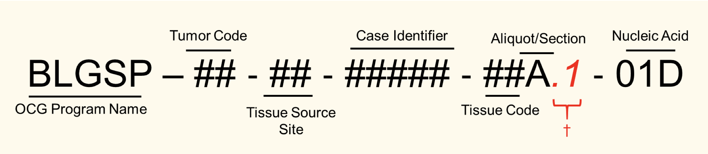
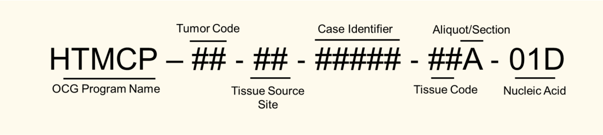
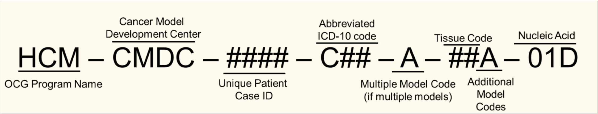
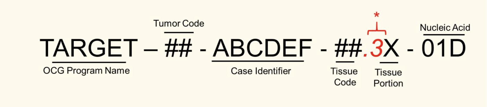
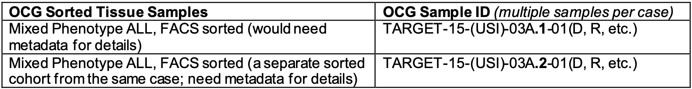
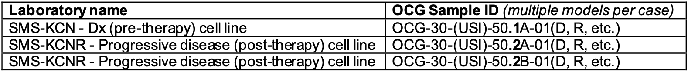

# OCG Project Codes including TARGET Barcode #
The ID of each sample will have a specific identifier that depends on the specific project. However, the
codes used in each are the same throughout OCG projects.

## Nomenclature ##

## HCMI Nomenclature Structure ##

## TARGET Nomenclature Structure ##

## TumorCode ##
| Tumor Code | Descripton |
| ------ | --------------- |
| 00 | Non-cancerous tissue |
| 01 | Diffuse large b-cell lymphoma (DLBCL) |
| 02 | Lung cancer (all types) |
| 03 | Cervical cancer (all types) |
| 04 | Anal cancer (all types) |
| 10 | Acute lymphoblastic leukemia (ALL) |
| 15 | Acute leukemia of ambiguous lineage (ALAL) |
| 20 | Acute myeloid leukemia (AML) |
| 21 | Induction failure AML (AML-IF) |
| 30 | Neuroblastoma (NBL) |
| 40 | Osteosarcoma (OS) |
| 41 | Ewing sarcoma |
| 50 | Wilms tumor (WT) |
| 51 | Clear cell sarcoma of the kidney (CCSK) |
| 52 | Rhabdoid tumor (kidney) (RT) |
| 60 | CNS, ependymoma |
| 61 | CNS, glioblastoma (GBM) |
| 62 | CNS, rhabdoid tumor |
| 63 | CNS, low grade glioma (LGG) |
| 64 | CNS, medulloblastoma |
| 65 | CNS, other |
| 70 | NHL, anaplastic large cell lymphoma |
| 71 | NHL, Burkitt lymphoma (BL) |
| 80 | Rhabdomyosarcoma |
| 81 | Soft tissue sarcoma, non-rhabdomyosarcoma |

## Tissue Code ##

| Tissue code | Description | Code |
| ----- | ------------ | -- |
| Primary tumor | Primary solid tumor | 01 |
| Recurrent tumor | Recurrent solid tumor | 02 |
| Primary blood cancer | Primary blood derived cancer – peripheral blood | 03 |
| Recurrent blood cancer | Recurrent blood derived cancer – bone marrow | 04 |
| Additional - new primary | Additional - new primary | 05 |
| Metastatic | Metastatic | 06 |
| Additional metastatic | Additional metastatic | 07 |
| Post neo-adjuvant therapy | Tissue disease-specific post-adjuvant therapy | 08 |
| Primary blood cancer BM | Primary blood derived cancer – bone marrow | 09 |
| Blood derived normal | Blood derived normal | 10 |
| Solid tissue normal | Solid tissue normal | 11 |
| Buccal cell normal | Buccal cell normal (including saliva) | 12 |
| EBV normal | Epstein-Barr virus (EBV) immortalized normal | 13 |
| BM normal | Bone marrow normal | 14 |
| Fibroblast normal | Fibroblasts from bone marrow normal | 15 |
| Mononuclear cell normal | Mononuclear cells from bone marrow normal | 16 |
| Lymphoid normal | Lymphatic tissue normal (including centroblasts) | 17 |
| Tumor adjacent normal – post neo-adjuvant therapy | Solid tissue “normal” near tumor, post-adjuvant therapy | 18 |
| Cell line control | Cell line control (control analyte) | 20 |
| Premalignant tissue | Neoplasms of uncertain and unknown behavior | 31 |
| Recurrent blood cancer | Recurrent blood derived cancer – peripheral blood | 40 |
| Post treatment blood cancer bone marrow | Blood derived cancer- bone marrow, post-treatment | 41 |
| Post treatment blood cancer blood | Blood derived cancer- peripheral blood, post-treatment | 42 |
| Cancer cell line | Cell line from patient tumor | 50 |
| Xenograft, primary | Xenograft from patient not grown as intermediate on plastic tissue culture dish | 60 |
| Xenograft, cell-line derived | Xenograft grown in mice from established cell lines | 61 |
| Next generation cancer model | Cancer models developed with next generation methods | 85 |
| Expanded next generation cancer model | Cancer models developed with next generation methods and expanded for distribution | 86 |
| Next generation cancer model expanded under non-conforming conditions | Next generation cancer models expanded differently than how they were developed | 87 |
| Granulocytes | Granulocytes after a Ficoll separation | 99 |

The tissue codes in the table above denote the source of tissue collected for study. A patient may under go multiple
tissue collections and/or resected tissue can be separated into smaller portions of material for research, and those
smaller sections may even be preserved using different methods (i.e. some flash frozen vs some with FFPE). Cell lines and
xenografts may also be grown up at different times. Therefore, a letter identifier is added to the tissue code number to
track separate aliquots/tissue sections from the same patient. For example:

            1. A – first aliquot, growth or section of tissue reviewed to meet clinical quality criteria
            2. B – second aliquot, growth or section of tissue reviewed to meet clinical quality criteria

Note: When characterizing multiple tissues from the same case, the sample codes must distinguish between these two types of
tissue by using a separate portion designation (i.e. the tissue codes used could be “01A” and “01B”, etc.)

## Nucleic Acid Codes ##
• 01D = DNA, unamplified, from the first isolation of a tissue (fresh/frozen)
• 01E = DNA, unamplified, from the first isolation of a tissue embedded in FFPE
• 01W = DNA, whole genome amplified by Qiagen (one independent reaction)
• 01X=DNA,wholegenomeamplifiedbyQiagen(asecond,separateindependentreaction) • 01Y = DNA, whole genome amplified by Qiagen (pool of “W” and “X” aliquots)
• 01R = RNA, from the first isolation of a tissue (fresh/frozen)
• 01S = RNA, from the first isolation of a tissue embedded in FFPE

*Note: If additional isolations are needed from the same tissue aliquot, the # would change to 02D, etc.*\
BLGSP: Additional tissue code sample identifiers (when a single tissue yields multiple sample subtypes)\
†*Pre-Extraction Manipulation of Tissue Samples (including Cell Sorting):*

Some analyses of patient tissues require certain tissue manipulation prior to nucleic acid extraction. For
example, some OCG tissue samples have undergone a specialized form of handling using flow cytometry called
Fluorescence-activated Cell Sorting (FACS) to separate a heterogeneous mixture of biological cells into two or more
subpopulations, one cell at a time, based upon the specific light scattering and fluorescent characteristics of
each cell type. Therefore, multiple cell types may be available for certain cases. Sorted samples can originate from
and/or result in tumor or normal tissues and will contain an extension of the tissue code following the letter “tissue portion”
identifier (i.e. BLGSP-XX-(USI)-03A.1- 01(D, R, etc.)). From the extension, it is not possible to determine specific
modifications or cell markers used to sort a subpopulation; users must use the metadata files to ascertain specific details
regarding the pre-extraction, post-pathology review handling of tissue. Tissue extension codes use sequential numbers
to denote only that a given sample is unique; the numbers themselves do not provide any additional information on specifics
of the sample.

Here is an example of two subpopulations from a FACS sort of the same tissue sample:

Note: Specific antibodies used for and sorted sample populations can be found in the associated OCG project metadata.
Additionally, small “c” before the antigen marker indicates the location is intracellular rather than cell surface.

## HCMI ICD-10 Codes ##
An abbreviated ICD-10 code is used to denote the anatomic site of the diagnostic tumor origin.

| ICD-10   | Anatomic Site |
| ----- | -----|
| C00-C14 | Head and neck |
| C15     | Esophageal |
| C16     | Stomach |
| C17     | Small intestine |
| C17     | Duodenal gastrinoma |
| C18     | Colon; Cecum    |
| C19     | Rectosigmoid junction |
| C20     | Rectum  |
| C22     | Liver or intrahepatic bile duct |
| C23     | Gallbladder |
| C24     | Ampulla of Vater or extrahepatic bile duct |
| C25     | Pancreas |
| C30     | Olfactory neuroblastoma  |
| C30-C32 | Head and neck |
| C34     | Bronchus and lung |
| C40-C41 | Ewing Sarcoma or osteosarcoma |
| C41     | Chordoma |
| C43     | Skin/Melanoma |
| C45     | Mesothelioma |
| C49     | Rhabdomyosarcoma |
| C50     | Breast |
| C54     | Endometrium |
| C56     | Ovary |
| C57     | Other female reproductive organs |
| C61     | Prostate |
| C64     | Wilms Tumor |
| C67     | Bladder |
| C71     | Brain and glioblastoma |
| C73     | Thyroid |
| C74     | Neuroblastoma |

## HCMI: Multiple Model Codes ##
Some cases may have multiple models derived from independent tumors (primary, recurrent, metastatic, etc.).
To distinguish between the unique models, each will be identified using a letter identifier following the ID3’s ICD-10
code to. For example:

           1. A – first cancer model
           2. B – second cancer model

Note: For cases in which multiple models per subject are known at the time of ID3 assignment, the first model will have
suffix “A”, the second model suffix “B”, etc. While it would be useful if suffix A would be associated with primary tumor, and the
other suffix letters with pre -malignant, recurrence, or metastasis, this may not be always true. For example, if a model
that is successfully generated and already gone through the CMDC pipeline (CDC-approved, shipped to BPC and ATCC), and in the
future, a model is generated from another tumor, the second model will receive the “B” suffix. The ID3 of the first model will
not be changed to include the “A” suffix.

## HCMI Additional Model Codes ##
If models from independent tumors from the same patient are generated, the samples will be identified by using the following
letter identifiers:

           1. M – metastatic tumor model
           2. N – second metastatic tumor model, from alternative location
           3. R – recurrent tumor model
           4. S – second recurrent tumor model, from a later date than R
           5. P – premalignant model

*TARGET: Additional tissue portion code sample identifier*\
\* *Cancer Models: Cell Lines/Xenografts:*

Some tissues are propagated as cell lines or xenografts. Multiple cell lines or xenografts may be available for certain cases, which
are derived from the tumor either at the time of surgery, at relapse, or during monitoring of therapeutic response. Various NCI projects have
decided to keep the codes for cell lines and xenografts “simple”, and OCG attempts to comply so that users can translate codes easily.
To address the issue of multiple in vitro cancer models per case, OCG projects will use the extension of “.1, .2, .3, etc.” following the
tumor tissue code within the sample name to differentiate the cell lines and xenografts; this extension is prior to the letter identifier(unlike sorted cells).
As with pre-extraction tissue manipulations, it is not possible to determine at which time point the original tumor was obtained from the extension.
It simply denotes a difference in samples, and users must refer to the appropriate metadata for details.  If xenografts or cell lines were established
either from 2 separate aliquots/tissue sections (either in the same lab or another), then the letter in the tissue code will reflect it.

Here are some examples:

Note that the .1, .2, etc. does not indicate any additional information except that there are multiple cell lines from this patient. In the above example“.1”does not indicate that
this cell line was established from a tumor obtained pre-therapy, nor “.2” post-therapy.  The number just indicates that they are separate isolates from a single case. In
addition, any case with only a single cell line or xenograft will not include the extension. The extension will only be used in the few cases where multiple samples are available.

In the example above,“OCG-30-(USI)-50.2B-01(D,R,etc.)” was generated either in another laboratory
or from a different tissue aliquot than “OCG-30-(USI)-50.2A-01(D, R, etc.)”.
